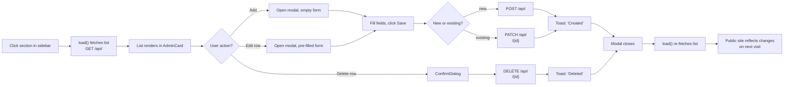
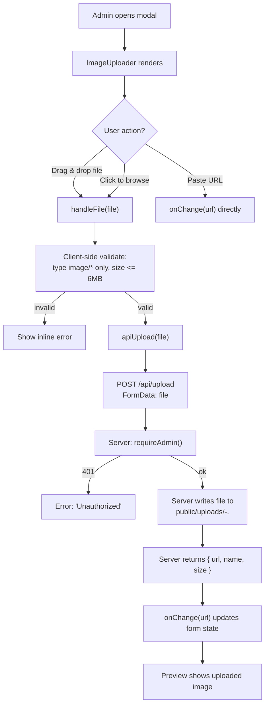
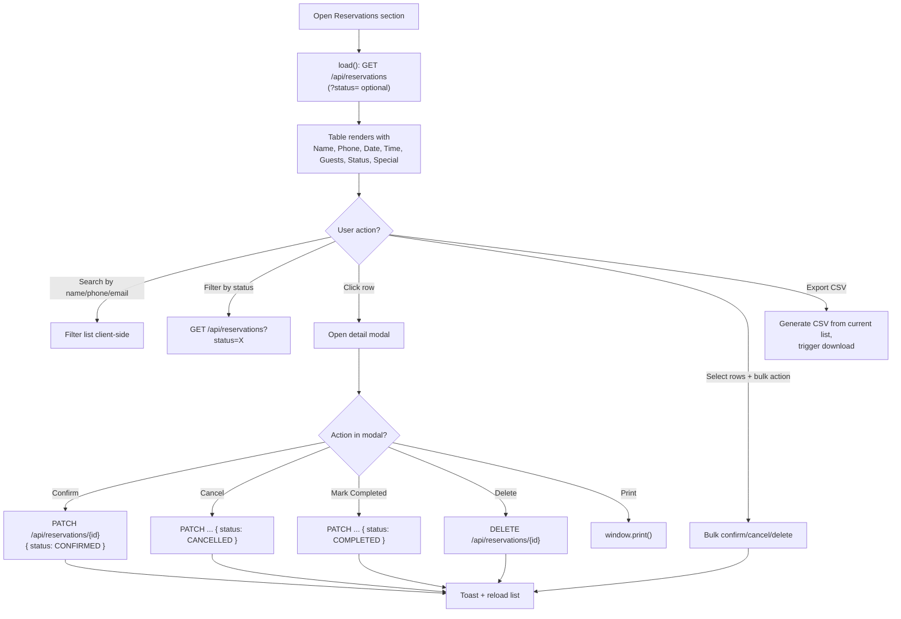
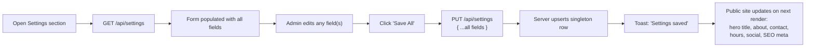
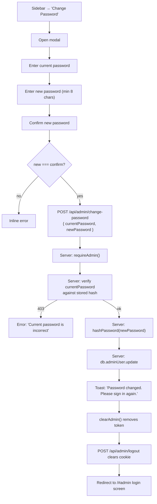
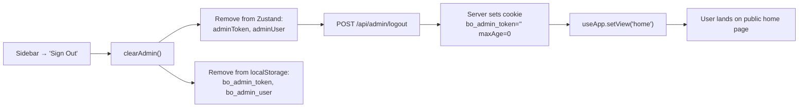

# Admin Workflow

End-to-end documentation of every flow inside the Black Orchid admin dashboard
(`/#admin`, served from `src/components/admin/AdminApp.tsx`).

The dashboard is a **single-page application** that lives inside the public
`/` route. View switching is handled by Zustand (`useApp.setView`) and URL
hashes (e.g. `#admin`). The admin sections (`overview`, `reservations`, `menu`,
`gallery`, `testimonials`, `events`, `catering`, `settings`) are rendered
conditionally inside `AdminApp.tsx`.

---

## 1. Login Flow

```mermaid
flowchart TD
    A["User navigates to /#admin"] --> B{adminToken in localStorage?}
    B -- yes --> C{Token valid?<br/>JWT not expired (12h)}
    B -- no --> D["LoginScreen renders"]
    C -- yes --> E["AdminApp renders<br/>with sidebar + overview"]
    C -- no --> D
    D --> F["Enter email + password"]
    F --> G["POST /api/admin/login<br/>{ email, password }"]
    G --> H{Credentials valid?}
    H -- no --> I["Show 'Invalid credentials' error"]
    I --> F
    H -- yes --> J["Server verifies bcrypt hash<br/>($2b$12$) via verifyPassword()"]
    J --> K["Server signs JWT HS256<br/>exp = now + 12h"]
    K --> L["Server sets httpOnly cookie<br/>bo_admin_token (maxAge 12h)"]
    K --> M["Server returns { token, user }"]
    M --> N["Client calls setAdmin(token, user)"]
    N --> O["Zustand stores adminUser + adminToken"]
    N --> P["localStorage: bo_admin_token<br/>+ bo_admin_user"]
    O --> E
```

Key files:

- `src/components/admin/AdminApp.tsx` — `LoginScreen` + section router.
- `src/app/api/admin/login/route.ts` — credential check, JWT sign, cookie set.
- `src/lib/auth.ts` — `hashPassword`, `verifyPassword`, `signToken`,
  `verifyToken`, `AUTH_COOKIE = "bo_admin_token"`.
- `src/lib/store.ts` — `setAdmin()` / `clearAdmin()` / `hydrateAdmin()`.

Default credentials (from `prisma/seed.ts`):

```
email:    admin@blackorchid.com
password: admin123
```

---

## 2. Dashboard Overview

Rendered by `AdminOverview.tsx`. Calls two endpoints in parallel:

- `GET /api/stats` — returns aggregate counts + 7-day chart + recent reservations
- `GET /api/menu` — returns categories (used for "popular dishes" breakdown)

Stats shown as `StatCard`s:

| Stat                  | Source                                                       |
| --------------------- | ------------------------------------------------------------ |
| Total reservations    | `db.reservation.count()`                                     |
| Today's reservations  | `db.reservation.count({ where: { date: today } })`           |
| Pending reservations  | `db.reservation.count({ where: { status: "PENDING" } })`     |
| Menu items            | `db.menuItem.count()`                                        |
| Gallery images        | `db.galleryImage.count()`                                    |
| Events                | `db.eventItem.count()`                                       |
| Testimonials          | `db.testimonial.count()`                                     |
| Visitors (placeholder)| Hard-coded `12840` — analytics not yet wired up              |

Additional dashboard widgets:

- **7-day reservations chart** — `BarChart` (recharts) of
  `stats.weekly: [{ date, count }, ...]`.
- **Recent reservations** — last 6, with relative timestamps and status badges.
- **Quick actions** — buttons that navigate to `menu`, `gallery`,
  `reservations`, `settings`.
- **Popular dishes** — derived from menu items (featured / chef-recommended
  ordering).

Loading state: 4-column skeleton grid. Empty state: friendly `EmptyState`.

---

## 3. CRUD Pattern

Every content section (`menu`, `gallery`, `testimonials`, `events`,
`catering`) follows the same pattern:



Implementation notes:

- The list component holds a `load()` callback stored in `useEffect`; after any
  mutation it is called again to refresh.
- Forms live inside a `Modal` (animated with Framer Motion `AnimatePresence`).
- All mutations require the admin JWT — see `requireAdmin()` in `src/lib/auth.ts`.
- Toasts use `sonner` (`toast.success`, `toast.error`).
- Optimistic UI is **not** used — we always re-fetch to guarantee consistency.

Section → API mapping:

| Section       | List endpoint        | Detail endpoint             |
| ------------- | -------------------- | --------------------------- |
| Menu          | `/api/menu`          | `/api/menu/{id}`            |
| Gallery       | `/api/gallery`       | `/api/gallery/{id}`         |
| Testimonials  | `/api/testimonials`  | `/api/testimonials/{id}`    |
| Events        | `/api/events`        | `/api/events/{id}`          |
| Catering      | `/api/catering`      | `/api/catering/{id}`        |
| Categories    | `/api/categories`    | `/api/categories/{id}`      |
| Reservations  | `/api/reservations`  | `/api/reservations/{id}`    |
| Settings      | `/api/settings`      | (singleton, PUT only)       |

---

## 4. Image Upload Flow

Used inside every "Add/Edit" modal that has an image field (menu, gallery,
events, catering, testimonials, settings).

Two reusable components live in `src/components/admin/ui.tsx`:

- `ImageUploader` — single image, drag-and-drop or click-to-select, with a
  "Paste URL" toggle.
- `MultiImageUploader` — array of images (used by menu item `images` field).



Key invariants:

- The database **never** stores Base64. Only the URL string is persisted.
- Files land in `public/uploads/` and are served statically by Next.js.
- The `Authorization: Bearer <token>` header is sent by `apiUpload()` (see
  `src/lib/api.ts`).
- The browser sets the `Content-Type: multipart/form-data; boundary=...`
  automatically — the JS code must NOT set it manually.

---

## 5. Reservation Management

Rendered by `AdminReservations.tsx`. The most feature-rich admin section.



Status transitions (`STATUSES` constant):

```
PENDING → CONFIRMED → COMPLETED
   ↓        ↓
CANCELLED  CANCELLED
```

- `Confirm` button is shown only when status is `PENDING`.
- `Mark completed` is shown only when status is `CONFIRMED`.
- `Cancel` is shown unless already `CANCELLED` or `COMPLETED`.
- `Delete` is always available (with a confirm dialog).

CSV export builds the file in-browser:

```ts
const rows = [["Name","Phone","Email","Date","Time","Guests","Status","Special"]];
sorted.forEach(r => rows.push([r.name, r.phone, r.email, r.date, r.time,
                               String(r.guests), r.status, r.special || ""]));
// ...join with proper quoting, then trigger a Blob download
```

Print uses the browser's native `window.print()` — the modal has print-specific
CSS so only the reservation card is visible on paper.

> Known limitation: no email is sent to the guest when a reservation is
> confirmed/cancelled. See `docs/KNOWN_ISSUES.md`.

---

## 6. Settings

Rendered by `AdminSettings.tsx`. Edits the singleton `SiteSettings` row.



Editable fields include (see `prisma/schema.prisma` → `SiteSettings`):

- **Brand**: `restaurantName`, `tagline`
- **Hero**: `heroTitle`, `heroSubtitle`
- **About**: `aboutTitle`, `aboutBody`
- **Contact**: `phone`, `email`, `address`, `whatsapp`
- **Hours**: `hoursWeekday`, `hoursWeekend`
- **Social**: `instagram`, `facebook`, `twitter`
- **Banquet**: `banquetCapacity`, `banquetDesc`
- **SEO**: `metaTitle`, `metaDesc`

The public site reads these from the same `/api/settings` endpoint, so changes
are reflected immediately on the next page render.

---

## 7. Change Password



Validations enforced server-side (`src/app/api/admin/change-password/route.ts`):

- `currentPassword` and `newPassword` both required
- `newPassword.length >= 8`
- `newPassword !== currentPassword`
- `currentPassword` must verify against the stored hash

After a successful change, the user is forced to sign in again because the
existing JWT is invalidated client-side (token cleared from localStorage and
the httpOnly cookie).

---

## 8. Logout



The server endpoint (`src/app/api/admin/logout/route.ts`) simply overwrites the
httpOnly cookie with an empty value and `maxAge: 0`, which deletes it from the
browser. The client also clears its own copies in `clearAdmin()`.

---

## Sidebar Sections

The left sidebar (`AdminApp.tsx`) lists these sections in order:

| Section       | Component                | Notes                              |
| ------------- | ------------------------ | ---------------------------------- |
| Overview      | `AdminOverview`          | Dashboard with stats + chart       |
| Reservations  | `AdminReservations`      | Search, filter, CSV, print, bulk   |
| Menu          | `AdminMenu`              | Items + categories                 |
| Gallery       | `AdminGallery`           | 16 images, drag to reorder         |
| Testimonials  | `AdminTestimonials`      | Ratings + featured flag            |
| Events        | `AdminEvents`            | Date, image, published flag        |
| Catering      | `AdminCatering`          | 3 packages, features list          |
| Settings      | `AdminSettings`          | Singleton site config              |
| Change Password | (modal)                | See §7                              |
| Sign Out      | (action)                 | See §8                              |

---

## Related

- [AUTHENTICATION.md](./AUTHENTICATION.md) — JWT + bcrypt internals.
- [API_REFERENCE.md](./API_REFERENCE.md) — full REST route reference.
- [IMAGE_STORAGE.md](./IMAGE_STORAGE.md) — upload pipeline details.
- [DATABASE_SEED.md](./DATABASE_SEED.md) — what's in the DB on first run.
