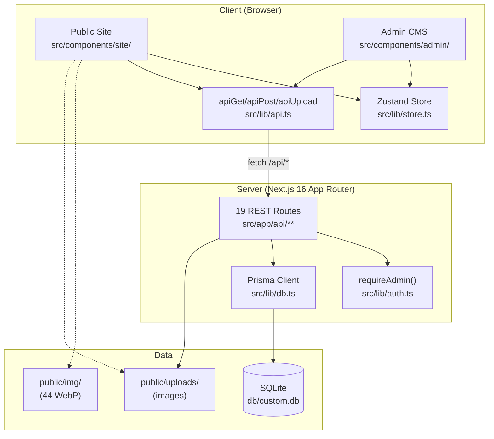

# AI Context

> **This is the most important document. Read it first.**
>
> It is written for future AI agents (and human contributors) who need to understand
> what Black Orchid *is*, *why it is the way it is*, and *what they may and may not do*.

---

## 0. Read These First

Before writing any code:

1. **`worklog.md`** (project root) — every past agent's work record. Append your own after finishing.
2. **`docs/PROJECT_MEMORY.md`** — the decisions that shaped the codebase and the lessons learned.
3. **`docs/CODING_STANDARDS.md`** — the rules. Follow them.
4. **`docs/DESIGN_SYSTEM.md`** + **`docs/ANIMATION_SYSTEM.md`** — the visual + motion language.
5. **`docs/KNOWN_ISSUES.md`** — known quirks. Don't "fix" benign warnings.

---

## 1. Project Vision

Black Orchid is **not a template**. It is a luxury hospitality brand experience rendered as a website.

The goal is for a visitor to feel — within the first 3 seconds — that they have arrived somewhere rare, considered, and expensive. Every pixel, every easing curve, every word of copy exists to reinforce that feeling. A user who doesn't book a table should still leave with the impression that Black Orchid is *the* special-occasion restaurant in the city.

This means:

- **The site is a film, not a brochure.** Views are scenes. Transitions matter. Whitespace matters. Silence matters.
- **The admin is a tool, not a showcase.** It must be fast, predictable, and never get in the way of the operator who is updating tonight's menu at 5pm.
- **The codebase serves the experience, not the other way around.** A technically elegant refactor that makes the home page feel 50ms less cinematic is a regression.

---

## 2. Brand Personality

| Trait | What it means in practice |
| --- | --- |
| **Elegant** | Restraint over excess. One gold accent, not five. Playfair over Papyrus. |
| **Sophisticated** | Editorial layouts. Asymmetric grids. Cormorant italic for subtext. Real photography, not stock illustrations. |
| **Exclusive** | "Reserve your evening," not "Book a table." Hairline borders, not chunky boxes. Quiet confidence. |
| **Warm** | Not cold or austere. The gold is *warm* gold (`#D4AF37` leaning amber), not chrome. Copy speaks to the guest, not at them. |

The voice in copy: third-person, present tense, sensory. "Hand-dived scallops seared to a golden crust." Not "Our delicious scallops are seared to perfection."

---

## 3. Design Philosophy

### 3.1 Dark + gold

- Background: `#0A0A0A` (warm near-black, not pure `#000`).
- Card surface: `#131313` (one step up for tonal contrast).
- Foreground: `#f5f0e8` (warm white, not `#fff` — pure white is harsh on a dark bg).
- Gold: `#D4AF37` (the signature; used sparingly for emphasis).
- Gold gradient: `#f0d878 → #d4af37 → #b8902a` (lighter to darker, for text/badges).
- Borders: `rgba(255,255,255,0.06)` (hairlines, barely visible — present but not loud).

> **No indigo. No blue. No purple.** These break the brand. If a chart needs a second color, use a muted off-white or a deeper amber.

### 3.2 Cinematic

- Full-viewport sections (`min-h-[100svh]` for the hero, `min-h-[60-70vh]` for view headers).
- Ambient gold orbs (soft blurred circles that drift) in dark sections.
- Film grain overlay (SVG fractal noise at 2.5% opacity) on cinematic sections.
- Hero video (`/hero-video.mp4`) with a WebP poster, autoplay + muted + loop.
- Word-by-word headline reveals (SplitType + GSAP, masked `yPercent: 110 → 0`).

### 3.3 Whitespace

- Generous padding (`py-24`, `py-32` between sections).
- `max-w-7xl mx-auto` for content width; full-bleed for cinematic banners.
- One bold idea per section. Don't stack four CTAs.

### 3.4 Editorial typography

- Headlines: Playfair Display, `text-5xl` to `text-8xl`, `tracking-luxe` (letter-spacing 0.04em), `leading-[1.02]`.
- Accent words in the gold gradient.
- Subtitles: Cormorant Garamond italic, `text-xl` to `text-2xl`, `text-muted-foreground`.
- Labels: Geist Sans, uppercase, `tracking-[0.2em]` to `tracking-[0.35em]`, `text-[11px]`.

---

## 4. Animation Philosophy

> **Subtle. Purposeful. Never distracting.**

### 4.1 What animation is for

- Revealing content as it enters the viewport (so the user isn't overwhelmed on first paint).
- Giving feedback to interaction (hover, click, focus).
- Easing the transition between views (so the SPA doesn't feel jarring).

### 4.2 What animation is NOT for

- Showing off. If the user notices the animation more than the content, it failed.
- Masking slow loading. Fix the loading, don't hide it behind a spinner.
- Being clever. A simple fade-up is almost always better than a fancy 3D flip.

### 4.3 Timing

| Motion | Duration | Easing |
| --- | --- | --- |
| Hover micro-interaction | 200–300ms | `ease-out` |
| Scroll-triggered reveal | 0.8s | `power3.out` / `power4.out` |
| Page transition (liquid glass) | ~0.85s total | `power3.inOut` |
| Magnetic button return | 0.5s | `elastic.out(1, 0.4)` |
| Cursor ring follow | spring | `stiffness: 400, damping: 28` |

### 4.4 Reduced motion is non-negotiable

Every animation must respect `prefers-reduced-motion: reduce`. Users who set this preference should see content appear immediately, with no motion. This is an accessibility requirement, not a nicety. See [CODING_STANDARDS.md](./CODING_STANDARDS.md) §6.3.

### 4.5 Cleanup is non-negotiable

Every GSAP animation must clean up on unmount (`gsap.context().revert()`). Every event listener must be removed. Memory leaks and stale tweens are the #1 cause of "the site feels janky after navigating around." See [CODING_STANDARDS.md](./CODING_STANDARDS.md) §6.4.

---

## 5. Coding Philosophy

### 5.1 TypeScript everywhere

No `.js` files in `src/`. No `any` where `unknown` will do. Strict mode on.

### 5.2 Tailwind, not CSS-in-JS

All styling is Tailwind utility classes. Custom CSS lives in `src/app/globals.css` (for design tokens and one-off utilities like `.ambient-orb`, `.glass-cinema`). No `styled-components`, no `emotion`, no CSS Modules.

### 5.3 Prisma for all database access

One ORM, one client (`src/lib/db.ts`). No raw SQL. The schema is the source of truth — change it in `prisma/schema.prisma`, then `db:push`.

### 5.4 GSAP for scroll, Framer Motion for components

Don't mix them for the same animation. Don't reinvent existing hooks. See [CODING_STANDARDS.md](./CODING_STANDARDS.md) §6.

### 5.5 The standalone build is sacred

`next.config.ts` sets `output: "standalone"`. The `build` script copies `public/`, `db/`, `prisma/`, `.env` into `.next/standalone/`. If you add a new runtime-required file or directory, **add it to the `build` script's `cp` commands** or the production server will break.

---

## 6. Rules (Hard Constraints)

These are non-negotiable. Violating them is a regression.

### DO NOT

1. **DO NOT redesign pages.** The cinematic design system is final. If a view feels off, refine within the system — don't replace it.
2. **DO NOT remove responsiveness.** Every view must work on 375px → 1920px+. Test on mobile before declaring done.
3. **DO NOT add indigo, blue, or purple.** The palette is dark + gold (+ muted neutrals). Period.
4. **DO NOT remove the liquid glass page transition.** It's a brand signature. You may refine its timing, but not replace it with a simple fade.
5. **DO NOT duplicate animation logic.** Use the existing hooks (`useFadeUp`, `useSplitText`, `useImageReveal`, `useMagnetic`, `usePageTransition`, `useLenis`). If you need a new pattern, add it to `gsap-utils.ts` or `premium-motion.ts` and reuse it.
6. **DO NOT break the admin CMS backward compatibility.** Existing API contracts (`GET /api/menu` returns categories-with-items, `POST /api/reservations` accepts the 7-field body, etc.) must keep working. Add fields, don't remove or rename them without a migration path.
7. **DO NOT change the Prisma schema without `db:push` + dev server restart.** See [KNOWN_ISSUES.md](./KNOWN_ISSUES.md) §3.
8. **DO NOT store Base64 in the database.** Images go to `public/uploads/`, URLs go in the DB. See [IMAGE_STORAGE.md](./IMAGE_STORAGE.md).
9. **DO NOT add `console.log` to client components in production.** Remove debug logs before committing.
10. **DO NOT skip `prefers-reduced-motion` checks.** Every animation must degrade gracefully.
11. **DO NOT skip GSAP cleanup.** Every `gsap.context()` must be `revert()`ed on unmount.
12. **DO NOT add server actions.** Use Next.js Route Handlers (`src/app/api/**/route.ts`) for all backend logic.

### DO

1. **Reuse existing primitives.** `LuxuryButton`, `Eyebrow`, `SectionHeading`, `OrnamentDivider`, `RevealText`, `ImageReveal`, `Parallax`, `RevealGroup`, `RevealItem`. Before writing new markup, check if a primitive already does it.
2. **Follow the current design system.** Token names (`bg-background`, `text-gold`, `glass-cinema`), font classes (`font-[family-name:var(--font-playfair)]`), spacing patterns (`py-24`, `max-w-7xl mx-auto`).
3. **Test on mobile + desktop.** Use the Preview Panel. Resize the browser. Use Agent Browser for a smoke test.
4. **Run `bun run lint` before committing.** Zero errors.
5. **Append to `worklog.md` after finishing.** Future agents read it.
6. **Read `dev.log` after making changes.** Catch runtime errors you didn't see in the UI.
7. **Keep admin styling scoped to `.admin-root`.** Admin classes (`admin-glass`, `admin-gold`, `admin-text`, etc.) must not leak into the public site. Public-site classes must not leak into admin.
8. **Find the root cause, not the symptom.** If a button "doesn't work," find out *why* (event handler? z-index? pointer-events?). Don't add a workaround that papers over the real bug.
9. **Preserve the Lighthouse 90+ score.** If your change drops performance, fix it before merging.

---

## 7. Architecture at a Glance

### Key architectural facts

- **Single public route (`/`)** with Zustand hash routing (`#menu`, `#gallery`, …). The `view` state in `src/lib/store.ts` decides which component renders.
- **Separate admin route (`/admin`)** — a full Next.js page, not part of the hash SPA.
- **19 REST API routes** under `src/app/api/` (see [API_REFERENCE.md](./API_REFERENCE.md)). JWT auth via `requireAdmin()`.
- **9 Prisma models** (see [DATABASE.md](./DATABASE.md)): `AdminUser`, `MenuCategory`, `MenuItem`, `GalleryImage`, `Reservation`, `Testimonial`, `EventItem`, `CateringPackage`, `SiteSettings`.
- **44 static WebP images** in `public/img/`, referenced by `src/lib/images.ts`. Admin uploads go to `public/uploads/`.
- **Standalone build** — `bun run build` produces `.next/standalone/` with everything needed to run.

---

## 8. Where Things Live

| If you need to... | Look in... |
| --- | --- |
| Change a public view | `src/components/site/<View>.tsx` |
| Change the admin CMS | `src/components/admin/Admin<Section>.tsx` |
| Add an API route | `src/app/api/<resource>/route.ts` |
| Change the database schema | `prisma/schema.prisma` (+ `bun run db:push`) |
| Add a design-system primitive | `src/components/site/primitives.tsx` |
| Add a motion helper | `src/components/site/gsap-utils.ts` or `premium-motion.ts` |
| Change global styles / tokens | `src/app/globals.css` |
| Change the layout / fonts / metadata | `src/app/layout.tsx` |
| Change the JWT / password logic | `src/lib/auth.ts` |
| Change the Zustand store | `src/lib/store.ts` |
| Add a static image | `public/img/` (+ reference in `src/lib/images.ts`) |
| Add seed data | `prisma/seed.ts` |
| Change the build | `package.json` (`scripts.build`) + `next.config.ts` |
| Change the gateway | `Caddyfile` |

---

## 9. When You're Asked To...

### Add a feature

1. **Search for an existing primitive.** Chances are `LuxuryButton`, `Modal`, `ImageUploader`, or a motion hook already does 80% of what you need.
2. **Follow the existing pattern.** If you're adding an admin CRUD section, mirror `AdminGallery.tsx` or `AdminEvents.tsx`. If you're adding a public view, mirror `MenuView.tsx` or `CateringView.tsx`.
3. **Use the cinematic header recipe.** Every public view starts with: full-bleed `min-h-[60-70vh]` darkened image, ambient orbs, `cinematic-grain`, `Eyebrow` + `RevealText` headline (with one gold-gradient accent word) + `OrnamentDivider` + Cormorant italic subtitle.
4. **Test on mobile + desktop.**
5. **Lint.**

### Fix a bug

1. **Reproduce it.** Don't fix what you can't see.
2. **Find the root cause.** Use `dev.log`, browser DevTools, and `console.error` (temporarily) to trace.
3. **Fix the cause, not the symptom.** If a button doesn't fire its onClick, find out if it's covered by another element (`z-index`), disabled by a stale state, or has `pointer-events: none` from a parent. Don't add `z-50` as a band-aid.
4. **Test the fix.** Verify the bug is gone AND no other feature broke.
5. **Lint.**

### Modify an animation

1. **Check `prefers-reduced-motion`.** Your change must still degrade gracefully.
2. **Clean up on unmount.** If you add a `gsap.context()`, return `() => ctx.revert()`.
3. **Don't make it longer.** 0.8s is the ceiling for a reveal. Anything longer feels sluggish.
4. **Don't make it bigger.** A 30px y-offset is plenty. 100px feels cartoonish.
5. **Test on mobile.** Animations that work on desktop can jank on a low-end phone.

### Change the database

1. **Edit `prisma/schema.prisma`.**
2. **Run `bun run db:push`.**
3. **Restart the dev server** (see [KNOWN_ISSUES.md](./KNOWN_ISSUES.md) §3).
4. **Update `src/lib/types.ts`** if the TypeScript type changed.
5. **Update affected API routes** (parsing, validation).
6. **Update the seed** if you want sample data for the new field.
7. **Update the admin UI** to expose the new field.

### Add an image

1. **For a static image:** drop the WebP in `public/img/`, add it to `src/lib/images.ts`, reference it via `IMAGES.<category>[n]`.
2. **For an admin upload:** the `ImageUploader` / `MultiImageUploader` already handle this. Don't add a new upload mechanism.
3. **Compress first.** Use Sharp: `sharp input.jpg --resize 1200 --webp --quality 78 > output.webp`. Max 1200px on the longest side.
4. **Always `loading="lazy" decoding="async"`** on `` (except above-the-fold hero images).

---

## 10. Common Mistakes to Avoid

1. **Adding `position: relative` to a section that has a Framer Motion `useScroll` target.** Triggers the "non-static position" warning. See [KNOWN_ISSUES.md](./KNOWN_ISSUES.md) §1.
2. **Forgetting `gsap.context().revert()` in a `useEffect` return.** Causes stale tweens after navigation.
3. **Using `<Image>` from `next/image`.** The codebase uses plain `` tags. See [CODING_STANDARDS.md](./CODING_STANDARDS.md) §5.3.
4. **Calling `setState` synchronously in a `useEffect` body.** Lint rule `react-hooks/set-state-in-effect` will fail. Use the lazy `useState(() => ...)` initializer or call `setState` inside an async `.then()`.
5. **Hardcoding an absolute URL in `fetch`.** Always use relative paths (`/api/menu`, not `http://localhost:3000/api/menu`). The gateway requires relative paths.
6. **Adding `"use server"` to API routes.** Next.js 16 Route Handlers are server-side by default. The directive is for Server Actions, which we don't use.
7. **Using `GoldButton`.** It no longer exists. Use `LuxuryButton`.
8. **Touching the admin CMS without reading the worklog.** The admin was declared FINALIZED in past tasks. Read `worklog.md` before changing it.
9. **Adding a new font.** Three fonts are loaded (`Playfair`, `Cormorant`, `Geist`). Adding another increases page weight and dilutes the typographic system.
10. **Skipping `worklog.md` after finishing.** Future agents depend on your record. Append a `---` section.

---

## 11. The 30-Second Test

After making any change, ask yourself:

1. Does it still feel like Black Orchid? (Dark, gold, cinematic, restrained.)
2. Does it work on a 375px-wide phone?
3. Does it work with `prefers-reduced-motion: reduce`?
4. Did I run `bun run lint`?
5. Did I read `dev.log` for new errors?
6. Did I append to `worklog.md`?

If any answer is no, you're not done.

---

## 12. Related Documentation

| Doc | Read it when... |
| --- | --- |
| [PROJECT_MEMORY.md](./PROJECT_MEMORY.md) | You want to understand *why* a decision was made |
| [CODING_STANDARDS.md](./CODING_STANDARDS.md) | You're writing code |
| [DESIGN_SYSTEM.md](./DESIGN_SYSTEM.md) | You're changing visuals |
| [ANIMATION_SYSTEM.md](./ANIMATION_SYSTEM.md) | You're touching motion |
| [COMPONENT_GUIDE.md](./COMPONENT_GUIDE.md) | You need to know what a component does |
| [API_REFERENCE.md](./API_REFERENCE.md) | You're changing the backend |
| [DATABASE.md](./DATABASE.md) | You're changing the schema |
| [KNOWN_ISSUES.md](./KNOWN_ISSUES.md) | You see a warning and wonder if it's expected |
| [ROADMAP.md](./ROADMAP.md) | You're asked "what's next?" |
| [CHANGELOG.md](./CHANGELOG.md) | You want to know what's been done |

---

> **Final word:** Black Orchid is a craft project, not a code factory. Treat every change as if you were the chef plating a dish for a guest who has waited six months for a reservation. Restraint, intention, and care.
