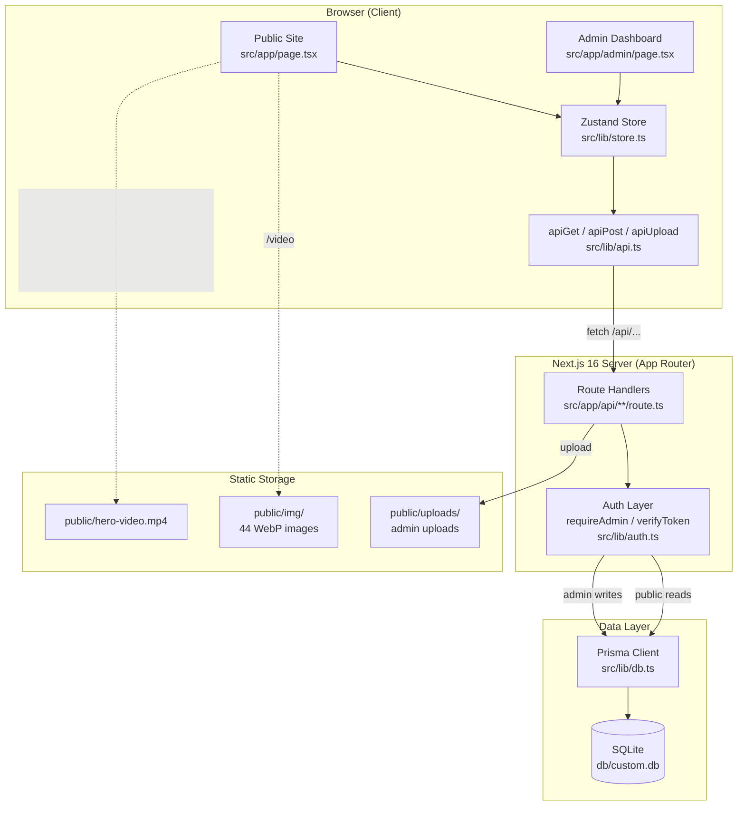
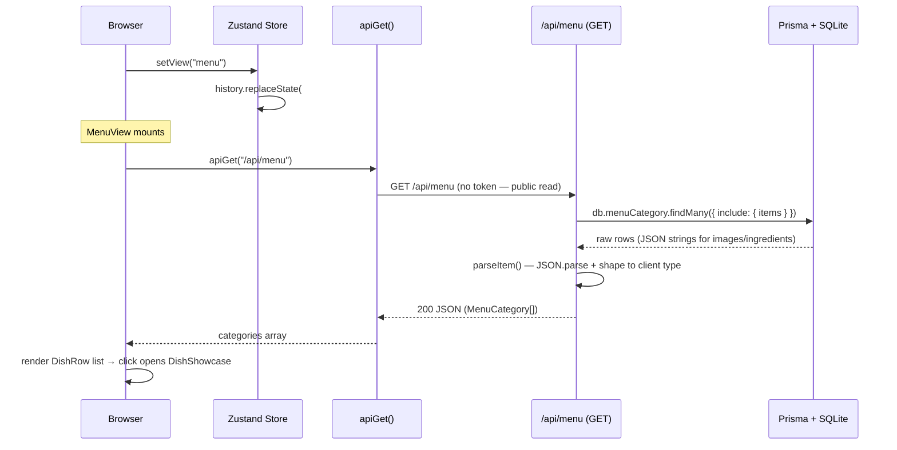
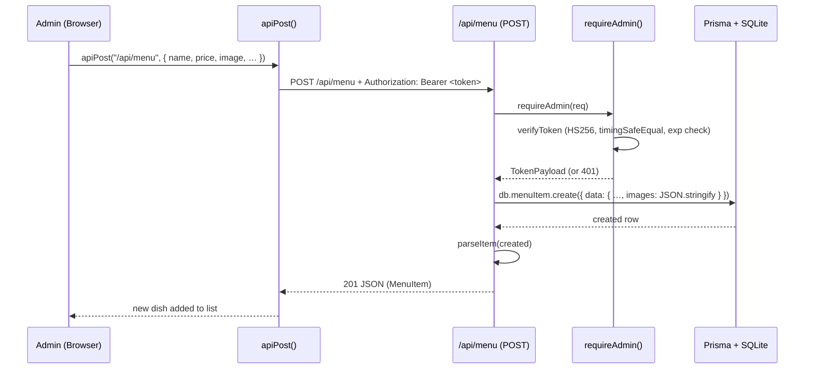

# Architecture

Black Orchid is a single Next.js 16 application with two distinct surfaces — a cinematic
public site and a CMS admin dashboard — sharing one database, one API layer, and one
design language. This document describes the layers, how they communicate, and how a
typical request flows from browser to database and back.

---

## High-Level Architecture



---

## Layer 1 — Frontend

**Technology:** Next.js 16 App Router, React 19, Tailwind CSS 4, Framer Motion, GSAP,
Lenis, Zustand.

The public site is a **single-page application** rendered by `src/app/page.tsx`. Rather
than using multiple Next.js routes for each "page" (Menu, Gallery, About, …), the app
uses a **client-side view router** powered by a Zustand store:

```ts
// src/lib/store.ts
export const useApp = create<State>((set) => ({
  view: "home",                     // current view
  setView: (v) => { … history.replaceState(…, `#${v}`) },
  adminToken: null,                 // JWT (hydrated from localStorage)
  adminUser: null,
}));
```

- **View switching** is instant (no network round-trip) and wrapped in a liquid-glass
  page transition (`usePageTransition`).
- **Hash sync** — `setView("menu")` updates the URL to `#menu` so views are shareable
  and the back/forward buttons work.
- The admin dashboard is a **separate Next.js route** at `/admin` (`src/app/admin/page.tsx`),
  rendered by `AdminApp`. It shares the same Zustand store for the admin session but has
  its own design system scoped to `.admin-root`.

All client-side data fetching goes through the typed helpers in `src/lib/api.ts`
(`apiGet`, `apiPost`, `apiPatch`, `apiPut`, `apiDelete`, `apiUpload`), which automatically
inject the admin JWT from the store as a `Bearer` header.

---

## Layer 2 — API

**Technology:** Next.js Route Handlers (REST), custom JWT auth.

Every API endpoint lives under `src/app/api/` as a `route.ts` file exporting standard
HTTP method handlers (`GET`, `POST`, `PATCH`, `PUT`, `DELETE`). The API is RESTful and
stateless.

### Endpoint Map

| Resource          | Public Read | Admin Write            | Route                                  |
| ----------------- | :---------: | :--------------------: | -------------------------------------- |
| Menu + Categories |     GET     | POST / PATCH / DELETE  | `/api/menu`, `/api/menu/[id]`, `/api/categories/[id]` |
| Gallery           |     GET     | POST / PATCH / DELETE  | `/api/gallery`, `/api/gallery/[id]`    |
| Reservations      |    POST     | GET / PATCH / DELETE   | `/api/reservations`, `/api/reservations/[id]` |
| Testimonials      |     GET     | POST / PATCH / DELETE  | `/api/testimonials`, `/api/testimonials/[id]` |
| Events            |     GET     | POST / PATCH / DELETE  | `/api/events`, `/api/events/[id]`      |
| Catering          |     GET     | POST / PATCH / DELETE  | `/api/catering`, `/api/catering/[id]`  |
| Site Settings     |     GET     | PUT                    | `/api/settings`                        |
| Stats             |      —      | GET                    | `/api/stats`                           |
| Admin Login       |      —      | POST                   | `/api/admin/login`                     |
| Admin Logout      |      —      | POST                   | `/api/admin/logout`                    |
| Change Password   |      —      | POST                   | `/api/admin/change-password`           |
| Image Upload      |      —      | POST                   | `/api/upload`                          |

### Auth Model

Write operations (and admin-only reads like `/api/stats` and `GET /api/reservations`)
are gated by `requireAdmin(req)`:

```ts
// src/lib/auth.ts
export async function requireAdmin(req: Request) {
  const token = getTokenFromRequest(req);   // Bearer header OR cookie
  return verifyToken(token);                // TokenPayload | null
}
```

- `getTokenFromRequest` checks the `Authorization: Bearer …` header first, then falls
  back to the `bo_admin_token` cookie.
- `verifyToken` validates the HS256 signature and expiry using `timingSafeEqual`.
- A `null` return → the route responds `401 Unauthorized`.

Public reads (menu, gallery, testimonials, events, catering, settings) are open — no
token required. This keeps the public site fast and cacheable.

---

## Layer 3 — Database

**Technology:** Prisma 6 ORM + SQLite (file-based).

The Prisma client is a singleton instantiated in `src/lib/db.ts`:

```ts
const globalForPrisma = globalThis as unknown as { prisma: PrismaClient | undefined };
export const db = globalForPrisma.prisma ?? new PrismaClient({ log: ['error', 'warn'] });
if (process.env.NODE_ENV !== 'production') globalForPrisma.prisma = db;
```

The global cache prevents multiple PrismaClient instances during Next.js hot-reloading
in development.

### Schema (9 models)

| Model            | Purpose                                             |
| ---------------- | --------------------------------------------------- |
| `AdminUser`      | CMS login accounts (email, bcrypt password, role)   |
| `MenuCategory`   | Menu sections (Starters, Main Course, …)            |
| `MenuItem`       | Individual dishes with rich fields (images JSON, ingredients JSON, allergens, spice, etc.) |
| `GalleryImage`   | Gallery photos with category + caption              |
| `Reservation`    | Table booking requests (status: PENDING/CONFIRMED/CANCELLED/COMPLETED) |
| `Testimonial`    | Guest reviews with rating + photo                   |
| `EventItem`      | Upcoming events (title, date, image, published)     |
| `CateringPackage`| Catering tiers (Silver Soirée / Golden Gala / Platinum Royal) |
| `SiteSettings`   | Singleton row with all editable site content        |

> **JSON-in-string columns:** Because SQLite cannot store arrays, `MenuItem.images`,
> `MenuItem.ingredients`, and `MenuItem.allergens` are stored as JSON strings and parsed
> in the API route (`parseItem`) before being sent to the client. See `prisma/schema.prisma`.

---

## Layer 4 — Storage

Static assets are served directly from `public/` by Next.js:

```
public/
├── img/              # 44 compressed WebP images (food, interior, drinks, banquet, dessert, avatars, hero, ambiance)
├── uploads/          # Runtime image uploads from the admin ImageUploader
├── hero-video.mp4    # Cinematic hero background video (~2.4 MB)
├── logo.svg
└── robots.txt
```

### Image Upload Flow

```
Admin ImageUploader
   │  (drag & drop or browse, ≤6 MB, JPG/PNG/WebP/GIF/AVIF)
   ▼
apiUpload(file) ──► POST /api/upload  (multipart/form-data + Bearer token)
                         │
                         ▼
                  Saves to public/uploads/<timestamp>-<hash>.<ext>
                         │
                         ▼
                  Returns { url: "/uploads/…" }
                         │
                         ▼
URL string stored in DB (e.g. MenuItem.image, GalleryImage.url)
```

**Base64 is never stored in the database** — only the URL string. This keeps the SQLite
file small and queries fast.

### Curated Image Registry

The 44 WebP images in `public/img/` are referenced through a typed registry in
`src/lib/images.ts`:

```ts
export const IMAGES = {
  hero: [...], food: [...], interior: [...], drinks: [...],
  banquet: [...], dessert: [...], ambiance: [...], avatar: [...],
} as const;
```

This lets components reference `IMAGES.food[0]` instead of hard-coding paths, and the
seed script uses the same registry for sample content.

---

## Layer 5 — Authentication

**Technology:** bcryptjs (password hashing) + custom JWT (HS256) in httpOnly cookies.

### Password Hashing

```ts
const BCRYPT_ROUNDS = 12;
export async function hashPassword(password: string) {
  const salt = await bcrypt.genSalt(BCRYPT_ROUNDS);
  return bcrypt.hash(password, salt);
}
```

`verifyPassword` supports both bcrypt hashes (current) and a legacy scrypt format
(`salt:hash` hex) for backward compatibility with older seeded accounts.

### JWT (HS256, 12-hour expiry)

Tokens are built manually — no external JWT library — to keep the dependency footprint
small:

```ts
signToken({ sub, email, role }, expiresInSeconds = 60 * 60 * 12)
// → "header.payload.signature"  (base64url, HMAC-SHA256 signed)
```

- **Header:** `Authorization: Bearer <token>` (sent by `apiPost`/`apiGet` from the store).
- **Cookie:** `bo_admin_token`, `httpOnly: true`, `sameSite: "lax"`, `maxAge: 12h`.
  Set by `/api/admin/login` on successful authentication.
- **Verification** uses `timingSafeEqual` to prevent timing attacks.

### Session Lifecycle

```
Login (POST /api/admin/login)
   │  verify password → sign JWT → set httpOnly cookie + return token
   ▼
AdminApp hydrates token from localStorage on mount (hydrateAdmin)
   │  Store: { adminToken, adminUser }
   ▼
Every API write attaches Authorization: Bearer <token>
   ▼
requireAdmin(req) verifies → route proceeds or returns 401
   ▼
Logout (clearAdmin) → removes localStorage + cookie cleared on next load
```

> The admin token is stored in `localStorage` for client-side gating (showing the login
> screen vs. the dashboard), but **real protection is on the API** — every write route
> calls `requireAdmin()`. A user cannot bypass auth by editing client state.

---

## Layer 6 — Deployment

**Technology:** Next.js standalone build + Caddy gateway.

`next.config.ts` sets `output: "standalone"`, which produces a self-contained server in
`.next/standalone/`. The `build` script then copies the runtime dependencies into place:

```bash
next build \
  && cp -r .next/static     .next/standalone/.next/ \
  && cp -r public           .next/standalone/ \
  && cp -r db               .next/standalone/ \
  && cp -r prisma           .next/standalone/ \
  && cp .env                .next/standalone/
```

Run the production server:

```bash
NODE_ENV=production bun .next/standalone/server.js
```

A **Caddy gateway** (`Caddyfile`) exposes a single external port and routes all requests
to the Next.js server. All API and asset requests use **relative paths** so the gateway
can forward them transparently.

---

## Data Flow: A Complete Request

### Example: Visitor opens the Menu view



### Example: Admin creates a menu item



---

## Architectural Decisions

### Why a client-side view router instead of multiple routes?

The public site is a **narrative experience** — transitions between views are part of
the design (the liquid-glass bloom). Client-side switching via Zustand makes these
transitions instant and choreographed, and avoids a full page reload that would re-mount
the Loader, Cursor, and Lenis instance. The trade-off (less granular per-route SEO) is
acceptable for a brand site whose primary content (menu, gallery) is also exposed via
JSON API for crawlers.

### Why SQLite?

A restaurant CMS has low write volume and a single operator. SQLite removes the need for
a database server, simplifies backups (copy one file), and keeps the deployment story
trivial. The Prisma schema can be swapped to PostgreSQL by changing the `datasource`
provider if scaling is ever needed.

### Why a custom JWT instead of NextAuth?

The auth surface is small (one admin role, login/logout/change-password). A hand-rolled
HS256 JWT with `timingSafeEqual` verification is ~80 lines, has no dependencies beyond
`bcryptjs`, and is trivially auditable. NextAuth is available in the dependency tree if
multi-provider or session-based auth is needed later.

### Why is the admin design system scoped to `.admin-root`?

The public site and admin share `globals.css` but have visually incompatible palettes
(the public site is near-black + warm gold; the admin is a cooler dark with a different
elevation system). Scoping admin styles to `.admin-root` (set on the admin wrapper)
prevents class leakage and lets both surfaces coexist without CSS conflicts.
