# Changelog

The implementation history of Black Orchid, grouped by phase. Dates are omitted
because the project evolves in task-sized increments tracked in `worklog.md`;
this document is the curated, reverse-chronological summary of *what shipped*.

> **Format:** Each entry lists the phase, what was added, the files touched,
> and a link to deeper docs where relevant. Newest phases are at the top.

---

## [Latest] Phase 10 — Polish, Hardening & Documentation

### Added
- **Password change feature** — `POST /api/admin/change-password` route + `ChangePasswordModal` in `AdminApp.tsx`. Validates current password, enforces 8-char minimum, signs out the user on success. bcrypt-hashed.
- **Admin sidebar collapse** — desktop sidebar collapses to a 72px icon rail; preference persisted to `localStorage` (`bo_admin_sidebar_collapsed`).
- **Mobile drawer for admin** — slide-in sidebar with backdrop, spring animation, on small screens.
- **Section title in admin topbar** — Playfair heading that reflects the active section.
- **"View Site" link in admin topbar** — opens the public site in a new tab.
- **Documentation set** — 9 new docs: `SEO.md`, `ENVIRONMENT_SETUP.md`, `DEPLOYMENT.md`, `TESTING.md`, `KNOWN_ISSUES.md`, `ROADMAP.md`, `CODING_STANDARDS.md`, `AI_CONTEXT.md`, `PROJECT_MEMORY.md`, plus this `CHANGELOG.md`.

### Fixed
- **Hash navigation** — direct URL navigation with `#menu` (or refresh on a hash) now lands on the correct view. `hydrateAdmin()` in `src/lib/store.ts` reads the hash on mount and listens for `hashchange`.
- **ScrollStack removed** — the pinned horizontal card stack on Home was removed due to layout bugs on mobile. Replaced with a simple GSAP fade-up grid. See [PROJECT_MEMORY.md](./PROJECT_MEMORY.md) §4.
- **Standalone build** — the `build` script now copies `db/`, `prisma/`, `public/`, `.env` into `.next/standalone/` so the production server has everything it needs.
- **`GoldButton` removed** — all usages replaced with `LuxuryButton` across `AboutView`, `BanquetView`, `CateringView`, `HoursView`, `MenuView`, `GalleryView`, `ReservationView`.

### Files Touched
- `src/app/api/admin/change-password/route.ts` (new)
- `src/components/admin/AdminApp.tsx` (password modal, sidebar collapse, mobile drawer)
- `src/lib/store.ts` (hash hydration)
- `package.json` (`build` script with `cp` commands)
- `docs/*.md` (10 new files)

---

## Phase 9 — Premium Motion System

### Added
- **Lenis smooth scrolling** — global `useLenis()` hook in `src/components/site/premium-motion.ts`. Disabled when `prefers-reduced-motion: reduce`.
- **SplitType text reveals** — `useSplitText()` hook for word-by-word masked headline reveals (`yPercent: 110 → 0`, `power4.out`).
- **Image mask reveal** — `useImageReveal()` hook with `clipPath: inset(0% 0% 100% 0%) → inset(0% 0% 0% 0%)` + scale `1.2 → 1.05`.
- **Magnetic buttons** — `useMagnetic()` hook; elements drift toward the cursor on `mousemove` (desktop, fine-pointer only).
- **Liquid glass page transition** — `usePageTransition()` hook. Multi-phase: darken → glass bloom from click origin → gold reflection streak → "Black Orchid" wordmark → content swap → glass retract. Variant-tinted per destination view. See [PROJECT_MEMORY.md](./PROJECT_MEMORY.md) §6.
- **Context-aware cursor** — `Cursor.tsx` with 5 states (default, hover, view, drag, text) + optional label. Gold dot + spring-following ring. Desktop only.
- **Film grain overlay** — global SVG fractal noise at 2.5% opacity in `src/app/layout.tsx`.
- **Loader** — cinematic curtain-lift intro with "Est. 2003" + gold letter-spacing reveal + progress line.

### Files Touched
- `src/components/site/premium-motion.ts` (new — Lenis, SplitType, image reveal, magnetic, page transition)
- `src/components/site/Cursor.tsx` (new)
- `src/components/site/Loader.tsx` (rewritten)
- `src/components/site/gsap-utils.ts` (existing hooks retained + re-exported)

---

## Phase 8 — Public Site Reinvention (Views)

### Added
- **Home** — hero video + parallax scale + ambient orbs + word-by-word headline reveal + staggered CTAs, manifesto, story (asymmetric 12-col grid + parallax image + floating stat card), signature dishes (4 staggered editorial cards), philosophy pillars, banquet cinema (full-viewport parallax), gallery preview (masonry + lightbox), circular gallery, testimonial cinema, reservation CTA.
- **MenuView** — cinematic header (`min-h-[70vh]`), sticky glass control bar (category pills + search + veg toggle), editorial single-column list (not a card grid), AnimatePresence transitions on category change, DishShowcase modal on click.
- **GalleryView** — cinematic header, filter pills (All/Food/Drinks/Interior/Events/Banquet), CSS columns masonry, lightbox with wrap-around navigation, "Load More" button.
- **ReservationView** — cinematic header, 5-step wizard (Details → Date/Time → Guests → Review → Confirm), direction-aware slide transitions, animated gold-check SVG success screen.
- **AboutView** — cinematic header, asymmetric story section, 4-stat band, philosophy section.
- **BanquetView** — cinematic header, staggered 3-image showcase, 6-amenity grid, glass-gold CTA.
- **CateringView** — cinematic header, 3 catering packages (middle highlighted "Most Popular"), 4-step process, gold phone CTA.
- **HoursView** — cinematic header, 7-day card with today-row highlight, glass-gold note card.
- **ContactView** — cinematic header, 2-col info/form layout, grayscale OpenStreetMap iframe.
- **LegalView** — ambient-orb-only header (no image), RevealText gold title, staggered gold-rule content blocks (6 Privacy + 6 Terms sections).

### Files Touched
- `src/components/site/Home.tsx` (rewritten)
- `src/components/site/MenuView.tsx` (rewritten)
- `src/components/site/GalleryView.tsx` (rewritten)
- `src/components/site/ReservationView.tsx` (rewritten)
- `src/components/site/AboutView.tsx` (rewritten)
- `src/components/site/BanquetView.tsx` (rewritten)
- `src/components/site/CateringView.tsx` (rewritten)
- `src/components/site/HoursView.tsx` (rewritten)
- `src/components/site/ContactView.tsx` (rewritten)
- `src/components/site/LegalView.tsx` (rewritten)

---

## Phase 7 — Signature Components

### Added
- **PillNav** — replaces the original sticky `Navbar`. Floating pill-shaped nav with sliding gold layoutId indicator, glass background, mobile horizontal scroll.
- **OptionWheel** — rotating selector component for choice-driven sections.
- **CircularGallery** — self-contained horizontal scroller with perspective-rotated cards. Used on Home for the gallery preview.
- **DishShowcase** — modal that opens when a menu item is clicked. Shows large image, ingredients, allergens, serving size, spice level, related dishes.
- **Lightbox** — fullscreen image viewer with prev/next navigation, used by GalleryView and Home's gallery preview.
- **Footer** — newsletter band with Playfair heading, 4-column grid, animated social icons, bottom bar with Privacy/Terms/Admin links.
- **Chrome** — `ScrollProgress` (gold scroll progress bar at top) + `StickyReserve` (mobile sticky reserve CTA).

### Files Touched
- `src/components/site/PillNav.tsx` (new)
- `src/components/site/OptionWheel.tsx` (new)
- `src/components/site/CircularGallery.tsx` (new)
- `src/components/site/DishShowcase.tsx` (new)
- `src/components/site/Lightbox.tsx` (new)
- `src/components/site/Footer.tsx` (rewritten)
- `src/components/site/Chrome.tsx` (rewritten)

---

## Phase 6 — Design System Foundation

### Added
- **Cinematic palette** in `src/app/globals.css` `:root` — `--background #0A0A0A`, `--card #131313`, `--foreground #f5f0e8`, `--muted-foreground #8a8a8a`, `--gold #D4AF37`, `--border rgba(255,255,255,0.08)`. Admin tokens untouched.
- **Cinematic utility classes** — `.cinematic-grain`, `.ambient-orb`, `.glass-cinema`, `.glass-gold-cinema`, `.text-gold-gradient`, `.bg-gold-gradient`, `.glow-gold`, `.glow-gold-hover`, `.ripple-container`, `.reveal-mask`, `.img-reveal`, `.tracking-luxe`, `.hairline-gold`, `.cursor-host` / `.cursor-dot` / `.cursor-ring`, `.animate-ken-burns`.
- **Motion helpers** in `src/components/site/motion.tsx` — `RevealGroup`, `RevealItem`, `RevealText` (word-by-word masked reveal), `Parallax`, `ImageReveal` (clip-path + scale), `ScrollLine`, `CountUp`.
- **Primitives** in `src/components/site/primitives.tsx` — `Eyebrow`, `DisplayHeading`, `SectionHeading`, `LuxuryButton` (solid/outline/ghost, ripple, glow, magnetic), `TextLink`, `OrnamentDivider`, `SpiceLevel`, `VegBadge`.
- **Fonts** in `src/app/layout.tsx` — Playfair Display (headlines), Cormorant Garamond (italic accents), Geist Sans (UI), loaded via `next/font/google`.

### Removed
- **`GoldButton`** — replaced by `LuxuryButton`. All usages migrated.

### Files Touched
- `src/app/globals.css` (palette + utilities)
- `src/components/site/motion.tsx` (new)
- `src/components/site/primitives.tsx` (rewritten)
- `src/app/layout.tsx` (fonts, metadata, film grain)

---

## Phase 5 — Admin CMS Rich Fields

### Added
- **Rich `MenuItem` fields** — `tagline`, `shortDescription`, `chefRecommended`, `ingredients[]`, `allergens[]`, `servingSize`, `images[]` (multi-image). Prisma schema updated; API routes serialize arrays to JSON strings (SQLite has no native array type).
- **MultiImageUploader** — grid of aspect-square thumbnails with cover badge, hover Replace/Delete, left/right reorder, file + URL inputs, 6MB validation. Located in `AdminMenu.tsx`.
- **TagInput** — Linear/Notion-style tag editor for ingredients (gold chips) and allergens (red chips with quick-add suggestions for common allergens).
- **SearchableSelect** — combobox primitive for category selection.
- **4-section ItemModal** — Essentials / Imagery / Dietary & Classification / Ingredients & Allergens.

### Files Touched
- `prisma/schema.prisma` (MenuItem fields)
- `src/lib/types.ts` (MenuItem type)
- `src/app/api/menu/route.ts` + `[id]/route.ts` (JSON serialization)
- `src/components/admin/AdminMenu.tsx` (ItemModal rewritten, MultiImageUploader added)
- `src/components/admin/ui.tsx` (TagInput, SearchableSelect primitives)
- `prisma/seed.ts` (24 menu items with full rich data)

---

## Phase 4 — Image Pipeline

### Added
- **44 compressed WebP images** in `public/img/` — compressed from CDN originals using Sharp (max 1200px, quality 78). Categories: hero (3), food (8), interior (8), drinks (6), banquet (6), dessert (5), ambiance (3), avatar (6).
- **Hero video** — `public/hero-video.mp4` (2.4 MB), used as the Home hero background with `autoPlay muted loop playsInline preload="auto"`.
- **`src/lib/images.ts`** — the static image manifest, imported by every view that needs curated images.
- **`POST /api/upload`** (expected) — multipart/form-data endpoint that saves uploaded files to `public/uploads/` with a `{timestamp}-{random-hex}.ext` filename. Used by `ImageUploader` and `MultiImageUploader`. (See [KNOWN_ISSUES.md](./KNOWN_ISSUES.md) §12 — verify the route file exists.)
- **`apiUpload()` helper** in `src/lib/api.ts` — wraps the FormData POST and returns the URL string.
- **`ImageUploader`** primitive in `src/components/admin/ui.tsx` — drag & drop, click-to-browse, paste-URL fallback, preview with Replace/Remove, progress bar, error display.

### Decisions
- **No Base64 in the database.** Hard rule. See [PROJECT_MEMORY.md](./PROJECT_MEMORY.md) §9.
- **No Next.js `<Image>` component.** Plain `` with `loading="lazy" decoding="async"`. See [CODING_STANDARDS.md](./CODING_STANDARDS.md) §5.3.
- **Local WebP, not CDN.** See [PROJECT_MEMORY.md](./PROJECT_MEMORY.md) §5.

### Files Touched
- `public/img/*.webp` (44 new files)
- `public/hero-video.mp4` (new)
- `src/lib/images.ts` (new)
- `src/lib/api.ts` (`apiUpload` added)
- `src/components/admin/ui.tsx` (`ImageUploader` added)

---

## Phase 3 — Admin CMS Dashboard

### Added
- **Admin route** — `src/app/admin/page.tsx`, separate from the public SPA.
- **AdminApp shell** — `src/components/admin/AdminApp.tsx`. Sidebar nav, topbar, mobile drawer, login screen, change-password modal.
- **8 CMS sections:**
  1. **Overview** (`AdminOverview`) — stats cards (reservations, menu, gallery, events, testimonials, packages), weekly reservations chart (Recharts), recent reservations list.
  2. **Reservations** (`AdminReservations`) — list with status filter, status change (PATCH), delete.
  3. **Menu** (`AdminMenu`) — categories + items, full CRUD, rich fields (Phase 5).
  4. **Gallery** (`AdminGallery`) — image grid with category badges, CRUD.
  5. **Testimonials** (`AdminTestimonials`) — list with avatars + ratings, featured toggle, CRUD.
  6. **Events** (`AdminEvents`) — list, publish/unpublish toggle, CRUD.
  7. **Catering** (`AdminCatering`) — 3 packages, CRUD.
  8. **Settings** (`AdminSettings`) — 20+ site-wide fields, PUT to singleton.
- **Admin primitives** in `src/components/admin/ui.tsx` — `AdminInput`, `AdminTextarea`, `AdminButton`, `Modal`, `Badge`, `Skeleton`, `EmptyState`, `AdminSectionTitle`, `Toggle`, `SearchableSelect`, `ImageUploader`, `TagInput`.
- **Admin styling** scoped to `.admin-root` in `src/app/globals.css` — separate token set (`admin-bg`, `admin-card`, `admin-text`, `admin-muted`, `admin-gold`, `admin-border`, `admin-glass`).

### Files Touched
- `src/app/admin/page.tsx` (new)
- `src/components/admin/AdminApp.tsx` (new)
- `src/components/admin/AdminOverview.tsx` (new)
- `src/components/admin/AdminReservations.tsx` (new)
- `src/components/admin/AdminMenu.tsx` (new)
- `src/components/admin/AdminGallery.tsx` (new)
- `src/components/admin/AdminTestimonials.tsx` (new)
- `src/components/admin/AdminEvents.tsx` (new)
- `src/components/admin/AdminCatering.tsx` (new)
- `src/components/admin/AdminSettings.tsx` (new)
- `src/components/admin/ui.tsx` (new)
- `src/app/globals.css` (admin section added)
- `src/app/api/stats/route.ts` (new — admin dashboard aggregates)

---

## Phase 2 — API + Auth + Database

### Added
- **Prisma schema** (`prisma/schema.prisma`) — 9 models: `AdminUser`, `MenuCategory`, `MenuItem`, `GalleryImage`, `Reservation`, `Testimonial`, `EventItem`, `CateringPackage`, `SiteSettings`. SQLite datasource.
- **Seed script** (`prisma/seed.ts`) — 1 admin, 1 settings singleton, 6 categories, 24 menu items, 16 gallery images, 6 testimonials, 4 events, 3 catering packages. Idempotent for admin/settings; destructive for content tables.
- **19 REST API routes** under `src/app/api/`:
  - `/api/admin/login`, `/api/admin/logout`, `/api/admin/change-password`
  - `/api/categories`, `/api/categories/[id]`
  - `/api/catering`, `/api/catering/[id]`
  - `/api/events`, `/api/events/[id]`
  - `/api/gallery`, `/api/gallery/[id]`
  - `/api/menu`, `/api/menu/[id]`
  - `/api/reservations`, `/api/reservations/[id]`
  - `/api/settings`
  - `/api/stats`
  - `/api/testimonials`, `/api/testimonials/[id]`
- **Auth** in `src/lib/auth.ts`:
  - `hashPassword` / `verifyPassword` — bcrypt (12 rounds), with legacy scrypt fallback.
  - `signToken` / `verifyToken` — custom HS256 JWT (12h expiry).
  - `requireAdmin(req)` — extracts token from `Authorization: Bearer` header or `bo_admin_token` cookie, verifies, returns payload or `null`.
- **Login route** sets httpOnly cookie (`sameSite: "lax"`, `path: "/"`, `maxAge: 12h`).
- **`src/lib/db.ts`** — Prisma Client singleton.
- **`src/lib/api.ts`** — client-side `apiGet`, `apiPost`, `apiPatch`, `apiPut`, `apiDelete`, `apiUpload` with automatic admin-token injection.
- **`src/lib/types.ts`** — all shared TypeScript types.
- **`src/lib/store.ts`** — Zustand store (view, setView, adminUser, adminToken, setAdmin, clearAdmin, hydrateAdmin).

### Decisions
- **Custom JWT over next-auth.** See [PROJECT_MEMORY.md](./PROJECT_MEMORY.md) §8.
- **bcrypt over scrypt.** See [PROJECT_MEMORY.md](./PROJECT_MEMORY.md) §7.
- **SQLite over Postgres.** See [PROJECT_MEMORY.md](./PROJECT_MEMORY.md) §1.

### Files Touched
- `prisma/schema.prisma` (new)
- `prisma/seed.ts` (new)
- `src/lib/db.ts` (new)
- `src/lib/auth.ts` (new)
- `src/lib/api.ts` (new)
- `src/lib/types.ts` (new)
- `src/lib/store.ts` (new)
- `src/app/api/**/route.ts` (19 new route files)
- `.env` (`DATABASE_URL`)

---

## Phase 1 — Project Scaffold

### Added
- **Next.js 16** project with App Router, TypeScript 5, React 19.
- **Tailwind CSS 4** with PostCSS, configured via `tailwind.config.ts` and `postcss.config.mjs`.
- **shadcn/ui (New York style)** — full component library in `src/components/ui/` (60+ components: Button, Card, Dialog, Input, Select, Table, Toast, Drawer, Sheet, Command, Calendar, etc.).
- **Lucide icons** — `lucide-react` for all icons.
- **Dependencies** — `gsap`, `lenis`, `framer-motion`, `split-type`, `zustand`, `prisma`, `@prisma/client`, `bcryptjs`, `sharp`, `recharts`, `sonner`, `@tanstack/react-query`, `next-themes`, `next-intl`, `next-auth` (installed but unused — see [PROJECT_MEMORY.md](./PROJECT_MEMORY.md) §8).
- **Configuration** — `next.config.ts` (`output: "standalone"`, `ignoreBuildErrors: true`, `reactStrictMode: false`), `tsconfig.json` (strict, `@/*` alias), `eslint.config.mjs`.
- **Scripts** — `dev`, `build`, `start`, `lint`, `db:push`, `db:generate`, `db:migrate`, `db:reset`, `postinstall`, `prebuild`.
- **Gateway** — `Caddyfile` for the sandbox reverse proxy.
- **404 page** — `src/app/not-found.tsx` with auto-redirect for admin URL typos.

### Files Touched
- `package.json`, `bun.lock`
- `next.config.ts`, `tsconfig.json`, `eslint.config.mjs`, `postcss.config.mjs`, `tailwind.config.ts`
- `src/app/layout.tsx`, `src/app/page.tsx`, `src/app/globals.css`, `src/app/not-found.tsx`
- `src/components/ui/*` (60+ shadcn components)
- `src/hooks/use-mobile.ts`, `src/hooks/use-toast.ts`
- `Caddyfile`

---

## Summary Timeline

```mermaid
flowchart LR
    P1["Phase 1<br/>Scaffold<br/>Next.js + Tailwind + shadcn"] --> P2["Phase 2<br/>API + Auth + DB<br/>Prisma + JWT + 19 routes"]
    P2 --> P3["Phase 3<br/>Admin CMS<br/>8 sections + primitives"]
    P3 --> P4["Phase 4<br/>Image Pipeline<br/>44 WebP + uploads"]
    P4 --> P5["Phase 5<br/>Rich Menu Fields<br/>MultiImage + Tags"]
    P5 --> P6["Phase 6<br/>Design System<br/>Dark+gold + primitives"]
    P6 --> P7["Phase 7<br/>Signature Components<br/>PillNav + Lightbox + DishShowcase"]
    P7 --> P8["Phase 8<br/>Public Site<br/>11 cinematic views"]
    P8 --> P9["Phase 9<br/>Premium Motion<br/>Lenis + SplitType + Liquid Glass"]
    P9 --> P10["Phase 10<br/>Polish + Docs<br/>Password change + 10 docs"]
```

---

## Stats

| Metric | Value |
| --- | --- |
| Public views | 11 (home, about, menu, banquet, gallery, catering, hours, contact, reservation, privacy, terms) |
| Admin sections | 8 (overview, reservations, menu, gallery, testimonials, events, catering, settings) |
| API routes | 19 REST + `/api/upload` + root `/api` |
| Prisma models | 9 |
| Static images | 44 WebP + 1 hero video |
| Seed data | 1 admin, 1 settings, 6 categories, 24 menu items, 16 gallery, 6 testimonials, 4 events, 3 catering packages |
| shadcn/ui components | 60+ |
| Documentation files | 26 (in `docs/`) |

---

## Related Documentation

- [worklog.md](../worklog.md) — The raw, task-by-task work log (append after every change)
- [PROJECT_MEMORY.md](./PROJECT_MEMORY.md) — The decisions behind each phase
- [ROADMAP.md](./ROADMAP.md) — What comes next
- [KNOWN_ISSUES.md](./KNOWN_ISSUES.md) — Current limitations
- [README.md](./README.md) — High-level project overview
