# Component Dependency Graph — Black Orchid

Visual dependency diagrams (Mermaid `graph TD`) for every major component tree in the
codebase. Each diagram shows what a component imports and renders, down to shared
primitives and library code.

> **Legend:**
> - Solid arrows (`A --> B`) mean "A imports/renders B".
> - Boxes group related modules.
> - Subgraphs group files by directory.

---

## Table of Contents

1. [App Shell (Public Root)](#1-app-shell-public-root)
2. [Home Page Dependency Tree](#2-home-page-dependency-tree)
3. [Home Sub-Components Detail](#3-home-sub-components-detail)
4. [Public View Components](#4-public-view-components)
5. [Admin App Dependency Tree](#5-admin-app-dependency-tree)
6. [Admin Section Dependencies](#6-admin-section-dependencies)
7. [Shared Primitives](#7-shared-primitives)
8. [API Layer Dependencies](#8-api-layer-dependencies)
9. [Data Layer Dependencies](#9-data-layer-dependencies)
10. [Full Project Dependency Map](#10-full-project-dependency-map)

---

## 1. App Shell (Public Root)

The public site is a single Next.js route (`/`) rendered by `src/app/page.tsx`.
It uses Zustand hash routing to swap between 11 views without changing the URL path.

```mermaid
graph TD
    Page["src/app/page.tsx<br/><code>Page()</code>"]
    Page -->|"uses"| useApp["lib/store.ts<br/>useApp, hydrateAdmin"]
    Page -->|"uses"| apiGet["lib/api.ts<br/>apiGet"]
    Page -->|"uses"| Settings["lib/types.ts<br/>SiteSettings"]
    Page -->|"renders"| PillNav["site/PillNav.tsx"]
    Page -->|"renders"| Footer["site/Footer.tsx"]
    Page -->|"renders"| Chrome["site/Chrome.tsx<br/>ScrollProgress, StickyReserve"]
    Page -->|"renders"| Cursor["site/Cursor.tsx"]
    Page -->|"renders"| Loader["site/Loader.tsx"]
    Page -->|"renders"| useLenis["site/premium-motion.ts<br/>useLenis"]
    Page -->|"renders"| usePageTransition["site/premium-motion.ts<br/>usePageTransition"]
    Page -->|"renders view="home""| Home["site/Home.tsx"]
    Page -->|"renders view="about""| AboutView["site/AboutView.tsx"]
    Page -->|"renders view="menu""| MenuView["site/MenuView.tsx"]
    Page -->|"renders view="banquet""| BanquetView["site/BanquetView.tsx"]
    Page -->|"renders view="gallery""| GalleryView["site/GalleryView.tsx"]
    Page -->|"renders view="catering""| CateringView["site/CateringView.tsx"]
    Page -->|"renders view="hours""| HoursView["site/HoursView.tsx"]
    Page -->|"renders view="contact""| ContactView["site/ContactView.tsx"]
    Page -->|"renders view="reservation""| ReservationView["site/ReservationView.tsx"]
    Page -->|"renders view="privacy""| LegalView["site/LegalView.tsx<br/>kind=privacy"]
    Page -->|"renders view="terms""| LegalView2["site/LegalView.tsx<br/>kind=terms"]
    Page -->|"if view="admin""| Router["next/navigation<br/>router.replace('/admin')"]

    classDef root fill:#1a1a1a,stroke:#d4af37,color:#fff
    classDef view fill:#0f0f0f,stroke:#444,color:#ccc
    class Page root
    class Home,AboutView,MenuView,BanquetView,GalleryView,CateringView,HoursView,ContactView,ReservationView,LegalView,LegalView2 view
```

**Notes:**
- `PillNav` (floating glass pill) is the active navigation, NOT `Navbar.tsx` (which exists
  in the codebase but is not imported by `page.tsx`).
- The `Cursor` component is rendered unconditionally but self-disables on touch devices
  via `window.matchMedia("(pointer: fine)")`.
- The `Loader` is a 1.9s cinematic intro that auto-dismisses.

---

## 2. Home Page Dependency Tree

`src/components/site/Home.tsx` is the most complex view — 10 sub-sections, each with
its own animation hooks and child components.

```mermaid
graph TD
    Home["site/Home.tsx<br/><code>Home&#123;settings&#125;</code>"]

    Home -->|"fetches"| apiGet["lib/api.ts<br/>apiGet"]
    Home -->|"fetches"| useApp["lib/store.ts<br/>useApp.setView"]
    Home -->|"uses"| IMAGES["lib/images.ts<br/>IMAGES"]
    Home -->|"uses"| Types["lib/types.ts<br/>MenuItem, GalleryImage,<br/>Testimonial, SiteSettings,<br/>MenuCategory"]
    Home -->|"imports"| Primitives["site/primitives.tsx<br/>Eyebrow, LuxuryButton,<br/>TextLink, OrnamentDivider,<br/>SpiceLevel, VegBadge"]
    Home -->|"imports"| Motion["site/motion.tsx<br/>RevealText, Parallax,<br/>ImageReveal, RevealGroup,<br/>RevealItem"]
    Home -->|"imports"| gsapUtils["site/gsap-utils.ts<br/>useFadeUp, useFadeScale,<br/>useParallax"]
    Home -->|"imports"| Lightbox["site/Lightbox.tsx"]
    Home -->|"imports"| CircularGallery["site/CircularGallery.tsx"]

    Home -->|"renders"| Hero["Hero"]
    Home -->|"renders"| SignatureDishes["SignatureDishes"]
    Home -->|"renders"| Story["Story"]
    Home -->|"renders"| ExperienceScrollStack["ExperienceScrollStack"]
    Home -->|"renders"| GalleryPreview["GalleryPreview"]
    Home -->|"renders"| BanquetCinema["BanquetCinema"]
    Home -->|"renders"| CircularGallerySection["CircularGallerySection"]
    Home -->|"renders"| TestimonialCinema["TestimonialCinema"]
    Home -->|"renders"| GoogleReviews["GoogleReviews"]
    Home -->|"renders"| ReservationCinema["ReservationCinema"]

    classDef home fill:#1a1a1a,stroke:#d4af37,color:#fff
    classDef section fill:#0f0f0f,stroke:#888,color:#ccc
    classDef shared fill:#0a1a0a,stroke:#4a8,color:#9c9
    class Home home
    class Hero,SignatureDishes,Story,ExperienceScrollStack,GalleryPreview,BanquetCinema,CircularGallerySection,TestimonialCinema,GoogleReviews,ReservationCinema section
    class Primitives,Motion,gsapUtils,Lightbox,CircularGallery,IMAGES,Types shared
```

---

## 3. Home Sub-Components Detail

Each sub-section of `Home.tsx` and its specific dependencies.

### 3.1 Hero

```mermaid
graph TD
    Hero["Hero&#123;settings&#125;"]
    Hero --> useApp["useApp.setView"]
    Hero --> useScroll["framer-motion<br/>useScroll, useTransform"]
    Hero --> IMAGES["IMAGES.hero[0]"]
    Hero --> RevealText["motion.tsx<br/>RevealText"]
    Hero --> LuxuryButton["primitives.tsx<br/>LuxuryButton"]
    Hero -->|"CTA: Reserve"| setViewRes["setView('reservation')"]
    Hero -->|"CTA: Menu"| setViewMenu["setView('menu')"]

    classDef c fill:#0f0f0f,stroke:#888,color:#ccc
    class Hero,useApp,useScroll,IMAGES,RevealText,LuxuryButton,setViewRes,setViewMenu c
```

### 3.2 SignatureDishes + DishCard

```mermaid
graph TD
    SD["SignatureDishes<br/>&#123;items, categories, onViewMenu&#125;"]
    SD --> useFadeUp["gsap-utils<br/>useFadeUp"]
    SD --> useFadeScale["gsap-utils<br/>useFadeScale"]
    SD --> RevealText["motion.tsx<br/>RevealText"]
    SD --> Eyebrow["primitives.tsx<br/>Eyebrow"]
    SD --> TextLink["primitives.tsx<br/>TextLink"]
    SD --> LuxuryButton["primitives.tsx<br/>LuxuryButton"]
    SD -->|"renders N times"| DishCard["DishCard<br/>&#123;item, index, onViewMenu&#125;"]
    DishCard --> motion["framer-motion<br/>motion.button"]
    DishCard --> VegBadge["primitives.tsx<br/>VegBadge"]
    DishCard --> SpiceLevel["primitives.tsx<br/>SpiceLevel"]

    classDef c fill:#0f0f0f,stroke:#888,color:#ccc
    class SD,DishCard,useFadeUp,useFadeScale,RevealText,Eyebrow,TextLink,LuxuryButton,motion,VegBadge,SpiceLevel c
```

### 3.3 Story

```mermaid
graph TD
    Story["Story&#123;settings, onReserve&#125;"]
    Story --> useApp["useApp.setView('about')"]
    Story --> Parallax["motion.tsx<br/>Parallax"]
    Story --> ImageReveal["motion.tsx<br/>ImageReveal"]
    Story --> RevealText["motion.tsx<br/>RevealText"]
    Story --> RevealGroup["motion.tsx<br/>RevealGroup"]
    Story --> RevealItem["motion.tsx<br/>RevealItem"]
    Story --> Eyebrow["primitives.tsx<br/>Eyebrow"]
    Story --> OrnamentDivider["primitives.tsx<br/>OrnamentDivider"]
    Story --> LuxuryButton["primitives.tsx<br/>LuxuryButton"]
    Story --> TextLink["primitives.tsx<br/>TextLink"]
    Story --> IMAGES["IMAGES.interior[0]"]

    classDef c fill:#0f0f0f,stroke:#888,color:#ccc
    class Story,useApp,Parallax,ImageReveal,RevealText,RevealGroup,RevealItem,Eyebrow,OrnamentDivider,LuxuryButton,TextLink,IMAGES c
```

### 3.4 ExperienceScrollStack + ExperienceCard

```mermaid
graph TD
    ESS["ExperienceScrollStack<br/>&#123;onReserve, onViewMenu, onBook&#125;"]
    ESS --> useFadeUp["gsap-utils<br/>useFadeUp"]
    ESS --> useFadeScale["gsap-utils<br/>useFadeScale"]
    ESS --> RevealText["motion.tsx<br/>RevealText"]
    ESS --> Eyebrow["primitives.tsx<br/>Eyebrow"]
    ESS -->|"renders 4 cards"| ExperienceCard["ExperienceCard<br/>&#123;card, index&#125;"]
    ExperienceCard --> IMAGES["IMAGES.food/interior/banquet"]

    classDef c fill:#0f0f0f,stroke:#888,color:#ccc
    class ESS,ExperienceCard,useFadeUp,useFadeScale,RevealText,Eyebrow,IMAGES c
```

### 3.5 GalleryPreview

```mermaid
graph TD
    GP["GalleryPreview<br/>&#123;images, onViewAll&#125;"]
    GP --> useFadeUp["gsap-utils<br/>useFadeUp"]
    GP --> useFadeScale["gsap-utils<br/>useFadeScale"]
    GP --> RevealText["motion.tsx<br/>RevealText"]
    GP --> Eyebrow["primitives.tsx<br/>Eyebrow"]
    GP --> TextLink["primitives.tsx<br/>TextLink"]
    GP --> LuxuryButton["primitives.tsx<br/>LuxuryButton"]
    GP --> Lightbox["site/Lightbox.tsx"]
    GP -->|"click tile"| setLbIndex["setLbIndex(i)"]

    classDef c fill:#0f0f0f,stroke:#888,color:#ccc
    class GP,useFadeUp,useFadeScale,RevealText,Eyebrow,TextLink,LuxuryButton,Lightbox,setLbIndex c
```

### 3.6 BanquetCinema

```mermaid
graph TD
    BC["BanquetCinema<br/>&#123;settings, onBook&#125;"]
    BC --> useScroll["framer-motion<br/>useScroll, useTransform"]
    BC --> RevealText["motion.tsx<br/>RevealText"]
    BC --> Eyebrow["primitives.tsx<br/>Eyebrow"]
    BC --> LuxuryButton["primitives.tsx<br/>LuxuryButton"]
    BC --> IMAGES["IMAGES.banquet[1]"]
    BC --> settings["settings.banquetDesc<br/>settings.banquetCapacity"]

    classDef c fill:#0f0f0f,stroke:#888,color:#ccc
    class BC,useScroll,RevealText,Eyebrow,LuxuryButton,IMAGES,settings c
```

### 3.7 CircularGallerySection

```mermaid
graph TD
    CGS["CircularGallerySection<br/>&#123;gallery&#125;"]
    CGS --> RevealText["motion.tsx<br/>RevealText"]
    CGS --> Eyebrow["primitives.tsx<br/>Eyebrow"]
    CGS -->|"renders"| CG["site/CircularGallery.tsx<br/>&#123;images&#125;"]
    CG --> motion["framer-motion"]
    CG --> cn["lib/utils.ts<br/>cn"]

    classDef c fill:#0f0f0f,stroke:#888,color:#ccc
    class CGS,CG,RevealText,Eyebrow,motion,cn c
```

### 3.8 TestimonialCinema

```mermaid
graph TD
    TC["TestimonialCinema<br/>&#123;testimonials&#125;"]
    TC --> AnimatePresence["framer-motion<br/>AnimatePresence"]
    TC -->|"auto-advances 7s"| setInterval["setInterval"]
    TC --> Quote["lucide-react<br/>Quote, Star"]

    classDef c fill:#0f0f0f,stroke:#888,color:#ccc
    class TC,AnimatePresence,setInterval,Quote c
```

### 3.9 GoogleReviews

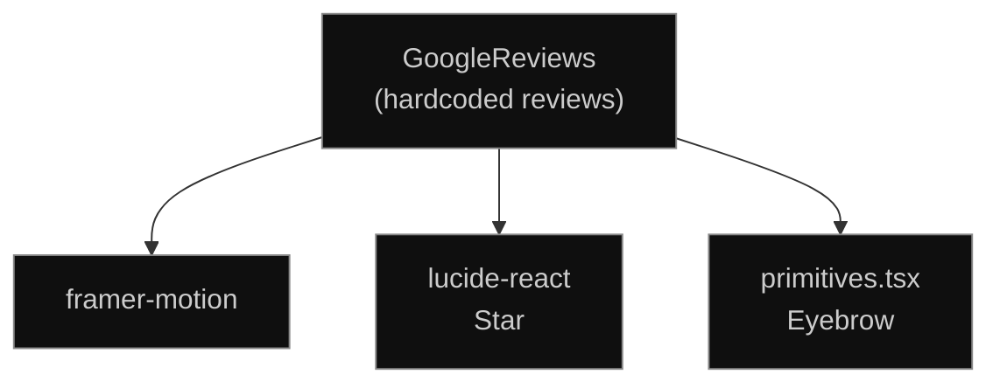

### 3.10 ReservationCinema

```mermaid
graph TD
    RC["ReservationCinema<br/>&#123;settings, onReserve&#125;"]
    RC --> useFadeUp["gsap-utils<br/>useFadeUp"]
    RC --> RevealText["motion.tsx<br/>RevealText"]
    RC --> Eyebrow["primitives.tsx<br/>Eyebrow"]
    RC --> LuxuryButton["primitives.tsx<br/>LuxuryButton"]
    RC --> settings["settings.phone<br/>settings.address"]

    classDef c fill:#0f0f0f,stroke:#888,color:#ccc
    class RC,useFadeUp,RevealText,Eyebrow,LuxuryButton,settings c
```

---

## 4. Public View Components

Dependencies for each non-home view component.

### 4.1 MenuView

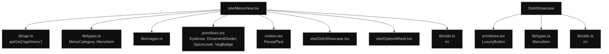

### 4.2 GalleryView

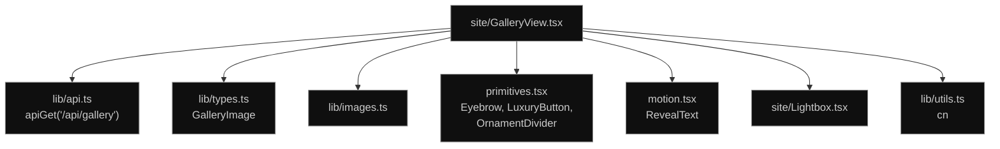

### 4.3 ReservationView

```mermaid
graph TD
    RV["site/ReservationView.tsx"]
    RV --> apiPost["lib/api.ts<br/>apiPost('/api/reservations')"]
    RV --> types["lib/types.ts<br/>Reservation"]
    RV --> IMAGES["lib/images.ts"]
    RV --> Eyebrow["primitives.tsx<br/>Eyebrow, LuxuryButton,<br/>OrnamentDivider"]
    RV --> RevealText["motion.tsx<br/>RevealText"]
    RV --> toast["sonner<br/>toast"]
    RV --> cn["lib/utils.ts<br/>cn"]
    RV -->|"renders sub"| StepIndicator["StepIndicator"]
    RV -->|"renders step 0"| StepDate["StepDate"]
    RV -->|"renders step 1"| StepTime["StepTime"]
    RV -->|"renders step 2"| StepGuests["StepGuests"]
    RV -->|"renders step 3"| StepDetails["StepDetails"]
    RV -->|"renders step 4"| StepConfirm["StepConfirm"]
    RV -->|"on success"| SuccessScreen["SuccessScreen<br/>(animated gold check SVG)"]

    classDef c fill:#0f0f0f,stroke:#888,color:#ccc
    class RV,apiPost,types,IMAGES,Eyebrow,RevealText,toast,cn,StepIndicator,StepDate,StepTime,StepGuests,StepDetails,StepConfirm,SuccessScreen c
```

### 4.4 Other Views (Catering, Contact, About, Banquet, Hours, Legal)

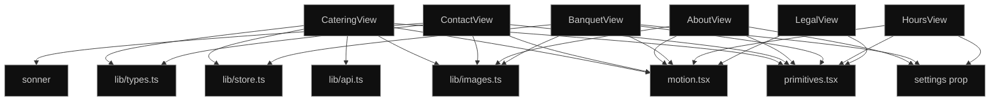

---

## 5. Admin App Dependency Tree

`src/app/admin/page.tsx` renders `AdminApp`, which is the entire admin shell.

```mermaid
graph TD
    AdminPage["src/app/admin/page.tsx"]
    AdminPage -->|"renders"| AdminApp["src/components/admin/AdminApp.tsx"]

    AdminApp --> useApp["lib/store.ts<br/>useApp (adminToken, adminUser,<br/>setAdmin, clearAdmin)"]
    AdminApp --> apiPost["lib/api.ts<br/>apiPost('/api/admin/login')"]
    AdminApp --> toast["sonner<br/>toast"]
    AdminApp --> cn["lib/utils.ts<br/>cn"]
    AdminApp --> ui["admin/ui.tsx<br/>AdminInput, AdminButton, Modal"]

    AdminApp -->|"if not authed"| LoginScreen["LoginScreen<br/>(inline)"]
    AdminApp -->|"renders shell"| SidebarContent["SidebarContent<br/>(desktop + mobile drawer)"]
    AdminApp -->|"renders shell"| ChangePasswordModal["ChangePasswordModal<br/>(inline)"]

    AdminApp -->|"section="overview""| AdminOverview
    AdminApp -->|"section="reservations""| AdminReservations
    AdminApp -->|"section="menu""| AdminMenu
    AdminApp -->|"section="gallery""| AdminGallery
    AdminApp -->|"section="testimonials""| AdminTestimonials
    AdminApp -->|"section="events""| AdminEvents
    AdminApp -->|"section="catering""| AdminCatering
    AdminApp -->|"section="settings""| AdminSettings

    AdminOverview["admin/AdminOverview.tsx"]
    AdminReservations["admin/AdminReservations.tsx"]
    AdminMenu["admin/AdminMenu.tsx"]
    AdminGallery["admin/AdminGallery.tsx"]
    AdminTestimonials["admin/AdminTestimonials.tsx"]
    AdminEvents["admin/AdminEvents.tsx"]
    AdminCatering["admin/AdminCatering.tsx"]
    AdminSettings["admin/AdminSettings.tsx"]

    classDef root fill:#1a1a1a,stroke:#d4af37,color:#fff
    classDef admin fill:#0a0f1a,stroke:#4a7,color:#9cf
    classDef shared fill:#1a0a0a,stroke:#a44,color:#faa
    class AdminPage,AdminApp root
    class LoginScreen,SidebarContent,ChangePasswordModal,AdminOverview,AdminReservations,AdminMenu,AdminGallery,AdminTestimonials,AdminEvents,AdminCatering,AdminSettings admin
    class useApp,apiPost,toast,cn,ui shared
```

---

## 6. Admin Section Dependencies

Each admin section follows the same pattern: import from `admin/ui.tsx`, call `apiGet`/
`apiPost`/`apiPatch`/`apiDelete` from `lib/api.ts`, and use `toast` for feedback.

### 6.1 AdminOverview

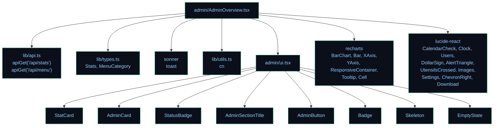

### 6.2 AdminReservations

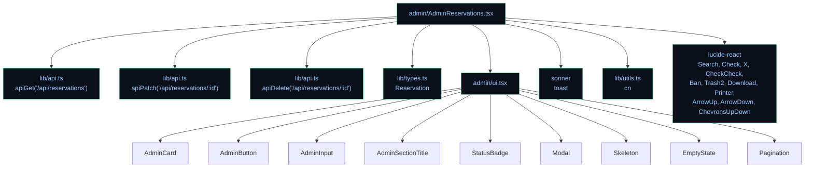

### 6.3 AdminMenu

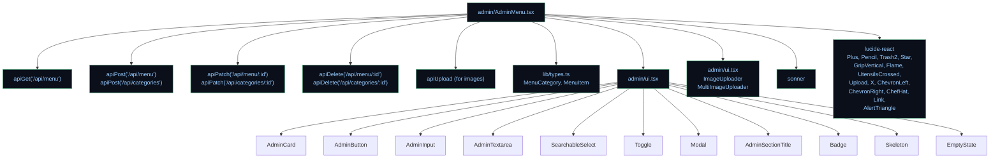

### 6.4 AdminGallery, AdminTestimonials, AdminEvents, AdminCatering, AdminSettings

All four CRUD sections follow the same shape. Here's the combined graph:

```mermaid
graph TD
    subgraph "AdminGallery"
        AG --> apiGet & apiPost & apiPatch & apiDelete & types["GalleryImage"]
        AG --> ui["ui.tsx: AdminCard, AdminButton,<br/>AdminInput, SearchableSelect,<br/>Modal, AdminSectionTitle,<br/>Badge, ImageUploader,<br/>Skeleton, EmptyState"]
    end
    subgraph "AdminTestimonials"
        AT --> apiGet2["apiGet/Post/Patch/Delete<br/>/api/testimonials"] & typesT["Testimonial"]
        AT --> ui2["ui.tsx: + AdminTextarea, Toggle<br/>(featured, rating select)"]
    end
    subgraph "AdminEvents"
        AE --> apiE["apiGet/Post/Patch/Delete<br/>/api/events"] & typesE["EventItem"]
        AE --> uiE["ui.tsx: + Toggle (published)"]
    end
    subgraph "AdminCatering"
        AC --> apiC["apiGet/Post/Patch/Delete<br/>/api/catering"] & typesC["CateringPackage"]
        AC --> uiC["ui.tsx: + ImageUploader"]
        AC --> splitFeatures["splitFeatures (pipe)"]
    end
    subgraph "AdminSettings"
        AS --> apiS["apiGet('/api/settings')<br/>apiPut('/api/settings')"]
        AS --> typesS["SiteSettings"]
        AS --> uiS["ui.tsx: AdminCard, AdminButton,<br/>AdminInput, AdminTextarea,<br/>AdminSectionTitle, Skeleton"]
    end

    AG["admin/AdminGallery.tsx"]
    AT["admin/AdminTestimonials.tsx"]
    AE["admin/AdminEvents.tsx"]
    AC["admin/AdminCatering.tsx"]
    AS["admin/AdminSettings.tsx"]

    classDef c fill:#0a0f1a,stroke:#4a7,color:#9cf
    class AG,AT,AE,AC,AS,apiGet,apiPost,apiPatch,apiDelete,types,ui,apiGet2,typesT,ui2,apiE,typesE,uiE,apiC,typesC,uiC,splitFeatures,apiS,typesS,uiS c
```

---

## 7. Shared Primitives

The two primitive libraries that everything else builds on.

### 7.1 `site/primitives.tsx` (Public)

```mermaid
graph TD
    primitives["site/primitives.tsx"]
    primitives --> cn["lib/utils.ts<br/>cn"]
    primitives --> motion["framer-motion<br/>motion"]
    primitives --> RevealText["site/motion.tsx<br/>RevealText"]
    primitives --> useMagnetic["site/premium-motion.ts<br/>useMagnetic"]
    primitives -->|"exports"| Eyebrow["Eyebrow"]
    primitives -->|"exports"| DisplayHeading["DisplayHeading"]
    primitives -->|"exports"| SectionHeading["SectionHeading"]
    primitives -->|"exports"| LuxuryButton["LuxuryButton<br/>(magnetic + ripple + glow)"]
    primitives -->|"exports"| TextLink["TextLink"]
    primitives -->|"exports"| OrnamentDivider["OrnamentDivider"]
    primitives -->|"exports"| SpiceLevel["SpiceLevel"]
    primitives -->|"exports"| VegBadge["VegBadge"]

    classDef c fill:#1a0a0a,stroke:#a44,color:#faa
    class primitives,cn,motion,RevealText,useMagnetic,Eyebrow,DisplayHeading,SectionHeading,LuxuryButton,TextLink,OrnamentDivider,SpiceLevel,VegBadge c
```

### 7.2 `site/motion.tsx` (Public, framer-motion based)

```mermaid
graph TD
    motion["site/motion.tsx"]
    motion --> framerMotion["framer-motion<br/>motion, useScroll, useTransform,<br/>useInView, useSpring, useMotionValue"]
    motion --> cn["lib/utils.ts<br/>cn"]
    motion -->|"exports"| useElementScroll["useElementScroll"]
    motion -->|"exports"| RevealGroup["RevealGroup"]
    motion -->|"exports"| revealItem["revealItem (variant)"]
    motion -->|"exports"| RevealItem["RevealItem"]
    motion -->|"exports"| RevealText["RevealText<br/>(word-by-word mask reveal)"]
    motion -->|"exports"| Parallax["Parallax"]
    motion -->|"exports"| ImageReveal["ImageReveal<br/>(clip-path + scale)"]
    motion -->|"exports"| ScrollLine["ScrollLine"]
    motion -->|"exports"| CountUp["CountUp"]

    classDef c fill:#1a0a0a,stroke:#a44,color:#faa
    class motion,framerMotion,cn,useElementScroll,RevealGroup,revealItem,RevealItem,RevealText,Parallax,ImageReveal,ScrollLine,CountUp c
```

### 7.3 `admin/ui.tsx` (Admin)

```mermaid
graph TD
    ui["admin/ui.tsx"]
    ui --> framerMotion["framer-motion<br/>motion, AnimatePresence"]
    ui --> lucide["lucide-react<br/>X, Check, ChevronDown, Search,<br/>Upload, Image, Trash2, AlertTriangle,<br/>ChevronLeft, ChevronRight, Inbox"]
    ui --> cn["lib/utils.ts<br/>cn"]
    ui --> apiUpload["lib/api.ts<br/>apiUpload"]

    ui -->|"exports"| AdminCard["AdminCard"]
    ui -->|"exports"| StatCard["StatCard"]
    ui -->|"exports"| Sparkline["Sparkline"]
    ui -->|"exports"| AdminSectionTitle["AdminSectionTitle"]
    ui -->|"exports"| Modal["Modal<br/>(focus trap, ESC, sticky footer)"]
    ui -->|"exports"| AdminInput["AdminInput"]
    ui -->|"exports"| AdminTextarea["AdminTextarea"]
    ui -->|"exports"| SearchableSelect["SearchableSelect<br/>(keyboard nav)"]
    ui -->|"exports"| Toggle["Toggle<br/>(animated spring)"]
    ui -->|"exports"| AdminButton["AdminButton<br/>(5 variants + confirm)"]
    ui -->|"exports"| StatusBadge["StatusBadge"]
    ui -->|"exports"| Badge["Badge (5 tones)"]
    ui -->|"exports"| ImageUploader["ImageUploader"]
    ui -->|"exports"| MultiImageUploader["MultiImageUploader"]
    ui -->|"exports"| Skeleton["Skeleton"]
    ui -->|"exports"| EmptyState["EmptyState"]
    ui -->|"exports"| Pagination["Pagination"]

    classDef c fill:#0a0f1a,stroke:#4a7,color:#9cf
    class ui,framerMotion,lucide,cn,apiUpload,AdminCard,StatCard,Sparkline,AdminSectionTitle,Modal,AdminInput,AdminTextarea,SearchableSelect,Toggle,AdminButton,StatusBadge,Badge,ImageUploader,MultiImageUploader,Skeleton,EmptyState,Pagination c
```

### 7.4 `site/gsap-utils.ts` + `site/premium-motion.ts` (Animation)

```mermaid
graph TD
    gsapUtils["site/gsap-utils.ts"]
    gsapUtils --> gsap["gsap"]
    gsapUtils --> ScrollTrigger["gsap/ScrollTrigger"]

    gsapUtils -->|"exports"| useFadeUp["useFadeUp"]
    gsapUtils -->|"exports"| useFadeScale["useFadeScale"]
    gsapUtils -->|"exports"| useParallax["useParallax"]
    gsapUtils -->|"exports"| useReveal["useReveal"]

    premiumMotion["site/premium-motion.ts"]
    premiumMotion --> gsap2["gsap"]
    premiumMotion --> ScrollTrigger2["gsap/ScrollTrigger"]
    premiumMotion --> Lenis["lenis"]
    premiumMotion --> SplitType["split-type"]
    premiumMotion -->|"re-exports"| useFadeUp
    premiumMotion -->|"re-exports"| useFadeScale
    premiumMotion -->|"re-exports"| useParallax
    premiumMotion -->|"exports"| useLenis["useLenis"]
    premiumMotion -->|"exports"| useSplitText["useSplitText"]
    premiumMotion -->|"exports"| useImageReveal["useImageReveal"]
    premiumMotion -->|"exports"| useMagnetic["useMagnetic"]
    premiumMotion -->|"exports"| usePageTransition["usePageTransition"]
    premiumMotion -->|"exports"| getLenis["getLenis"]

    classDef c fill:#0a1a0a,stroke:#4a8,color:#9c9
    class gsapUtils,premiumMotion,gsap,ScrollTrigger,gsap2,ScrollTrigger2,Lenis,SplitType,useFadeUp,useFadeScale,useParallax,useReveal,useLenis,useSplitText,useImageReveal,useMagnetic,usePageTransition,getLenis c
```

---

## 8. API Layer Dependencies

How the API client and route handlers depend on auth and store.

### 8.1 Client API Layer

```mermaid
graph TD
    api["lib/api.ts<br/>(client-side)"]
    api -->|"reads token from"| store["lib/store.ts<br/>useApp.getState().adminToken"]
    api -->|"POST /api/upload"| uploadRoute["app/api/upload/route.ts"]

    api -->|"exports"| apiGet["apiGet<T>(path)"]
    api -->|"exports"| apiPost["apiPost<T>(path, body)"]
    api -->|"exports"| apiPatch["apiPatch<T>(path, body)"]
    api -->|"exports"| apiPut["apiPut<T>(path, body)"]
    api -->|"exports"| apiDelete["apiDelete(path)"]
    api -->|"exports"| apiUpload["apiUpload(file) → url"]

    classDef c fill:#1a0a0a,stroke:#a44,color:#faa
    class api,store,uploadRoute,apiGet,apiPost,apiPatch,apiPut,apiDelete,apiUpload c
```

**Token injection:** `authHeaders()` reads `useApp.getState().adminToken` and returns
`{ Authorization: 'Bearer <token>' }` if present. All `apiGet/Post/Patch/Put/Delete`
calls merge these headers into their requests.

### 8.2 Server-Side Auth Flow

```mermaid
graph TD
    routeHandler["app/api/*/route.ts<br/>(POST/PATCH/PUT/DELETE)"]
    routeHandler -->|"calls"| requireAdmin["lib/auth.ts<br/>requireAdmin(req)"]
    requireAdmin -->|"reads"| getTokenFromRequest["getTokenFromRequest(req)"]
    getTokenFromRequest -->|"checks header"| authHeader["Authorization: Bearer ..."]
    getTokenFromRequest -->|"checks cookie"| cookie["bo_admin_token cookie"]
    requireAdmin -->|"calls"| verifyToken["verifyToken(token)"]
    verifyToken -->|"decodes"| payload["TokenPayload<br/>{sub, email, role, exp}"]
    verifyToken -->|"HMAC-SHA256"| secret["process.env.ADMIN_JWT_SECRET"]
    verifyToken -->|"timingSafeEqual"| compare["compare signatures"]
    requireAdmin -->|"returns"| result["TokenPayload | null"]
    result -->|"null"| unauthorized["401 Unauthorized"]
    result -->|"valid"| proceed["proceed with mutation"]

    classDef c fill:#1a0a0a,stroke:#a44,color:#faa
    class routeHandler,requireAdmin,getTokenFromRequest,authHeader,cookie,verifyToken,payload,secret,compare,result,unauthorized,proceed c
```

### 8.3 Login Flow

```mermaid
graph TD
    login["app/api/admin/login/route.ts"]
    login -->|"receives"| creds["{email, password}"]
    login -->|"calls"| db["lib/db.ts<br/>db.adminUser.findUnique"]
    login -->|"calls"| verifyPassword["lib/auth.ts<br/>verifyPassword"]
    verifyPassword -->|"bcrypt or scrypt"| compare["compare hash"]
    login -->|"calls"| signToken["lib/auth.ts<br/>signToken"]
    signToken -->|"HMAC-SHA256"| token["JWT string"]
    login -->|"sets cookie"| res["NextResponse<br/>bo_admin_token (httpOnly, 12h)"]
    login -->|"returns"| response["{token, user}"]

    classDef c fill:#1a0a0a,stroke:#a44,color:#faa
    class login,creds,db,verifyPassword,compare,signToken,token,res,response c
```

---

## 9. Data Layer Dependencies

How the database is accessed.

```mermaid
graph TD
    subgraph "Route Handlers"
        reservations["api/reservations/route.ts<br/>api/reservations/[id]/route.ts"]
        menu["api/menu/route.ts<br/>api/menu/[id]/route.ts<br/>api/categories/[id]/route.ts"]
        gallery["api/gallery/route.ts<br/>api/gallery/[id]/route.ts"]
        testimonials["api/testimonials/route.ts<br/>api/testimonials/[id]/route.ts"]
        events["api/events/route.ts<br/>api/events/[id]/route.ts"]
        catering["api/catering/route.ts<br/>api/catering/[id]/route.ts"]
        settings["api/settings/route.ts"]
        stats["api/stats/route.ts"]
        upload["api/upload/route.ts"]
        login["api/admin/login/route.ts"]
        logout["api/admin/logout/route.ts"]
        changePw["api/admin/change-password/route.ts"]
    end

    subgraph "Shared Lib"
        db["lib/db.ts<br/>PrismaClient singleton"]
        auth["lib/auth.ts<br/>requireAdmin, signToken,<br/>verifyToken, hashPassword,<br/>verifyPassword"]
    end

    subgraph "Prisma"
        prismaClient["@prisma/client"]
        schema["prisma/schema.prisma<br/>9 models"]
    end

    reservations --> db & auth
    menu --> db & auth
    gallery --> db & auth
    testimonials --> db & auth
    events --> db & auth
    catering --> db & auth
    settings --> db & auth
    stats --> db & auth
    upload --> auth
    login --> db & auth
    logout --> auth
    changePw --> db & auth

    db --> prismaClient
    prismaClient --> schema

    classDef route fill:#0a0f1a,stroke:#4a7,color:#9cf
    classDef lib fill:#1a0a0a,stroke:#a44,color:#faa
    classDef db fill:#0a1a0a,stroke:#4a8,color:#9c9
    class reservations,menu,gallery,testimonials,events,catering,settings,stats,upload,login,logout,changePw route
    class db,auth lib
    class prismaClient,schema db
```

### Prisma Models

```mermaid
graph TD
    AdminUser["AdminUser<br/>id, email, name, password,<br/>role, timestamps"]
    MenuCategory["MenuCategory<br/>id, name, slug, order"]
    MenuItem["MenuItem<br/>id, name, price, images (JSON),<br/>categoryId, featured, chefRecommended,<br/>veg, spice, ingredients (JSON),<br/>allergens (JSON), order"]
    GalleryImage["GalleryImage<br/>id, title, url, caption,<br/>category, order"]
    Reservation["Reservation<br/>id, name, phone, email,<br/>date, time, guests, special,<br/>status (default PENDING)"]
    Testimonial["Testimonial<br/>id, name, role, photo, rating,<br/>message, featured, order"]
    EventItem["EventItem<br/>id, title, description, date,<br/>image, published"]
    CateringPackage["CateringPackage<br/>id, name, description, price,<br/>image, guests, features, order"]
    SiteSettings["SiteSettings<br/>id='singleton',<br/>heroTitle, aboutBody, phone,<br/>email, address, hours, socials,<br/>banquetCapacity, metaTitle"]

    MenuCategory -->|"1:N"| MenuItem
    MenuItem -->|"N:1<br/>onDelete: Cascade"| MenuCategory

    classDef c fill:#0a1a0a,stroke:#4a8,color:#9c9
    class AdminUser,MenuCategory,MenuItem,GalleryImage,Reservation,Testimonial,EventItem,CateringPackage,SiteSettings c
```

---

## 10. Full Project Dependency Map

A bird's-eye view of the entire dependency graph (simplified — only top-level modules).

```mermaid
graph TD
    subgraph "Next.js App"
        page["app/page.tsx<br/>(public root)"]
        adminPage["app/admin/page.tsx<br/>(admin root)"]
        apiRoutes["app/api/**<br/>(19 REST routes)"]
    end

    subgraph "Public Components"
        Home["site/Home.tsx<br/>+ 10 sub-sections"]
        Views["site/*View.tsx<br/>(11 views)"]
        Primitives["site/primitives.tsx"]
        Motion["site/motion.tsx"]
        GsapUtils["site/gsap-utils.ts"]
        PremiumMotion["site/premium-motion.ts"]
        Chrome["site/Chrome, Cursor,<br/>Loader, PillNav, Footer"]
        Showcases["site/DishShowcase,<br/>Lightbox, CircularGallery,<br/>OptionWheel"]
    end

    subgraph "Admin Components"
        AdminApp["admin/AdminApp.tsx"]
        AdminSections["admin/Admin*.tsx<br/>(8 sections)"]
        AdminUI["admin/ui.tsx"]
    end

    subgraph "Shared Lib"
        api["lib/api.ts"]
        store["lib/store.ts"]
        auth["lib/auth.ts"]
        db["lib/db.ts"]
        types["lib/types.ts"]
        utils["lib/utils.ts"]
        images["lib/images.ts"]
    end

    subgraph "External"
        prisma["@prisma/client"]
        schema["prisma/schema.prisma"]
        gsap["gsap + ScrollTrigger"]
        lenis["lenis"]
        splitType["split-type"]
        framer["framer-motion"]
        lucide["lucide-react"]
        sonner["sonner"]
        recharts["recharts"]
        zustand["zustand"]
        bcrypt["bcryptjs"]
    end

    page --> Home & Views & Chrome & PremiumMotion & store & api
    adminPage --> AdminApp
    AdminApp --> AdminSections & AdminUI & store & api & sonner

    Home --> Primitives & Motion & GsapUtils & Showcases & api & store & types & images
    Views --> Primitives & Motion & api & types & images & store
    Showcases --> Primitives & types & utils

    Primitives --> Motion & PremiumMotion & utils
    Motion --> framer & utils
    GsapUtils --> gsap
    PremiumMotion --> gsap & lenis & splitType & GsapUtils

    AdminUI --> framer & lucide & utils & api
    AdminSections --> AdminUI & api & types & sonner & lucide

    api --> store
    apiRoutes --> db & auth
    auth --> bcrypt
    db --> prisma
    prisma --> schema
    store --> zustand

    classDef next fill:#1a1a1a,stroke:#d4af37,color:#fff
    classDef pub fill:#0f0f0f,stroke:#888,color:#ccc
    classDef adm fill:#0a0f1a,stroke:#4a7,color:#9cf
    classDef lib fill:#1a0a0a,stroke:#a44,color:#faa
    classDef ext fill:#0a1a0a,stroke:#4a8,color:#9c9
    class page,adminPage,apiRoutes next
    class Home,Views,Primitives,Motion,GsapUtils,PremiumMotion,Chrome,Showcases pub
    class AdminApp,AdminSections,AdminUI adm
    class api,store,auth,db,types,utils,images lib
    class prisma,schema,gsap,lenis,splitType,framer,lucide,sonner,recharts,zustand,bcrypt ext
```

---

## Dependency Hygiene Rules

1. **No circular imports.** `primitives.tsx` imports from `motion.tsx` and
   `premium-motion.ts`, but neither imports back from `primitives.tsx`.
2. **`lib/api.ts` is the only client-side fetch layer.** Components never call `fetch`
   directly — they use `apiGet/Post/Patch/Put/Delete/Upload`.
3. **`lib/auth.ts` is server-only.** It imports `crypto` and `bcryptjs`, which are
   Node.js modules. Never import it from a client component.
4. **`lib/db.ts` is server-only.** Prisma Client runs on the server. Client components
   access data exclusively through `apiGet` calls to REST routes.
5. **`admin/ui.tsx` does not import from `site/`.** The admin and public design systems
   are deliberately separated — admin uses `admin-*` CSS classes, public uses the
   gold-on-black luxury aesthetic.
6. **`gsap-utils.ts` and `premium-motion.ts` are client-only.** Both are guarded by
   `typeof window !== "undefined"` checks at module top-level for SSR safety.
7. **All views receive `settings` as a prop** from `page.tsx`, which fetches it once.
   Views do not call `apiGet('/api/settings')` themselves (except `page.tsx`).
8. **Image URLs come from `lib/images.ts`** (curated local WebP) or from the database
   (admin-uploaded, stored in `public/uploads/`). No external CDN URLs in code.
