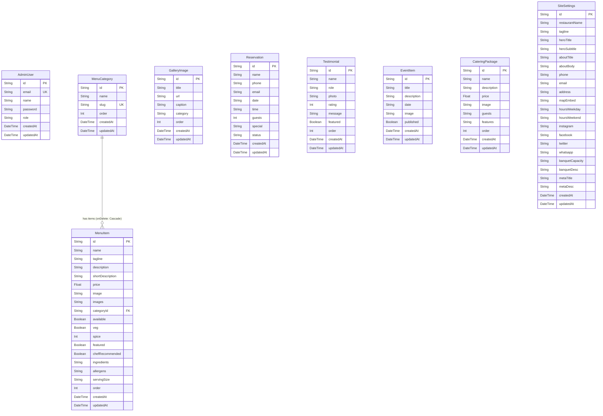

# Database

Black Orchid uses **Prisma ORM** with a **SQLite** database file at `db/custom.db` (configured via `DATABASE_URL=file:./db/custom.db` in `.env`). The Prisma client is exposed via `src/lib/db.ts` as a singleton.

> **Source of truth**
> - `prisma/schema.prisma` — schema definition
> - `src/lib/db.ts` — Prisma client singleton
> - `prisma/seed.ts` — seed script
> - `db/custom.db` — the SQLite database file

---

## 1. Configuration

### `prisma/schema.prisma`

```prisma
generator client {
  provider = "prisma-client-js"
}

datasource db {
  provider = "sqlite"
  url      = env("DATABASE_URL")
}
```

### `.env`
```
DATABASE_URL=file:./db/custom.db
ADMIN_JWT_SECRET=<your-secret>  # defaults to "black-orchid-dev-secret-change-me" if unset
```

### `src/lib/db.ts` — Singleton Client

```ts
import { PrismaClient } from '@prisma/client'

const globalForPrisma = globalThis as unknown as {
  prisma: PrismaClient | undefined
}

export const db =
  globalForPrisma.prisma ??
  new PrismaClient({ log: ['error', 'warn'] })

if (process.env.NODE_ENV !== 'production') globalForPrisma.prisma = db
```

The `globalThis` cache prevents Next.js's hot-reloading dev server from instantiating multiple Prisma clients (which would exhaust the SQLite connection pool). Logging is set to `error` and `warn` only — successful queries are silent.

---

## 2. Migration Strategy

**There are no migration files.** Schema changes are applied via `prisma db push`:

```bash
bun run db:push   # prisma db push
```

`db:push` synchronizes the schema with the database without creating migration history. This is appropriate for:
- Single-developer / small-team projects
- SQLite (which has limited migration support anyway)
- Rapid iteration during development

**Trade-off:** no auditable migration history. If you need to track schema evolution, switch to `prisma migrate dev` (which creates timestamped SQL files in `prisma/migrations/`).

### Available npm scripts
| Script | Command | Use |
|--------|---------|-----|
| `db:push` | `prisma db push` | Apply schema changes to DB |
| `db:generate` | `prisma generate` | Regenerate the Prisma Client (also runs on `postinstall` and `prebuild`) |
| `db:migrate` | `prisma migrate dev` | Create a migration (not currently used) |
| `db:reset` | `prisma migrate reset` | Drop and re-seed (destructive) |

### After schema changes
- The dev server **must be restarted** for the new Prisma Client to be picked up. HMR does not regenerate the client.
- `bun run db:push` followed by `bun run dev` (or a manual restart) is the workflow.

---

## 3. Models Overview

9 models total: 1 auth, 2 menu (category + item), 1 gallery, 1 reservation, 1 testimonial, 1 event, 1 catering, 1 settings singleton.

### ER Diagram



---

## 4. Model Details

### `AdminUser`

| Column | Type | Default | Notes |
|--------|------|---------|-------|
| `id` | String | `cuid()` | Primary key |
| `email` | String | — | Unique, lowercased on lookup |
| `name` | String | — | Display name |
| `password` | String | — | bcrypt hash (12 rounds). Legacy scrypt hashes (`salt:hash` hex) are also accepted by `verifyPassword`. |
| `role` | String | `"ADMIN"` | One of `ADMIN | MANAGER | EDITOR`. **Not yet enforced per-route** — all admin routes accept any valid admin token regardless of role. |
| `createdAt` | DateTime | `now()` | |
| `updatedAt` | DateTime | `@updatedAt` | Auto-updated by Prisma |

### `MenuCategory`

| Column | Type | Default | Notes |
|--------|------|---------|-------|
| `id` | String | `cuid()` | |
| `name` | String | — | Display name |
| `slug` | String | — | Unique. Auto-derived from name in API if not provided. |
| `order` | Int | `0` | Sort order ascending |
| `createdAt` | DateTime | `now()` | |
| `updatedAt` | DateTime | `@updatedAt` | |

**Relations:** `items` — one-to-many to `MenuItem`, cascade-deleted.

### `MenuItem`

| Column | Type | Default | Notes |
|--------|------|---------|-------|
| `id` | String | `cuid()` | |
| `name` | String | — | |
| `tagline` | String? | `null` | Short poetic subtitle |
| `description` | String | — | Full description (required) |
| `shortDescription` | String? | `null` | One-liner for cards |
| `price` | Float | — | In USD |
| `image` | String? | `null` | **Legacy** single-image field. Kept in sync with `images[0]` by the API. |
| `images` | String | `"[]"` | **JSON string** of an array of URLs (see §5) |
| `categoryId` | String | — | FK to `MenuCategory.id` |
| `available` | Boolean | `true` | Toggle visibility |
| `veg` | Boolean | `false` | Vegetarian badge |
| `spice` | Int | `0` | 0–3 (None / Mild / Medium / Hot) |
| `featured` | Boolean | `false` | Show on Home "Signature Dishes" |
| `chefRecommended` | Boolean | `false` | Chef's hat badge |
| `ingredients` | String | `"[]"` | **JSON string** of an array of strings |
| `allergens` | String | `"[]"` | **JSON string** of an array of strings |
| `servingSize` | String? | `null` | e.g. "4 pieces", "200g" |
| `order` | Int | `0` | Sort within category |
| `createdAt` | DateTime | `now()` | |
| `updatedAt` | DateTime | `@updatedAt` | |

**Relations:** `category` — many-to-one to `MenuCategory`. `onDelete: Cascade` — deleting a category deletes all its items.

### `GalleryImage`

| Column | Type | Default | Notes |
|--------|------|---------|-------|
| `id` | String | `cuid()` | |
| `title` | String | — | |
| `url` | String | — | Image URL (relative path like `/img/...` or `/uploads/...`) |
| `caption` | String? | `null` | |
| `category` | String | `"Interior"` | One of `Food | Drinks | Interior | Events | Banquet` |
| `order` | Int | `0` | |
| `createdAt` | DateTime | `now()` | |
| `updatedAt` | DateTime | `@updatedAt` | |

### `Reservation`

| Column | Type | Default | Notes |
|--------|------|---------|-------|
| `id` | String | `cuid()` | |
| `name` | String | — | Guest name |
| `phone` | String | — | |
| `email` | String | — | |
| `date` | String | — | `YYYY-MM-DD` format |
| `time` | String | — | `HH:MM` (24h) or `h:mm a` |
| `guests` | Int | — | Party size |
| `special` | String? | `null` | Special requests |
| `status` | String | `"PENDING"` | One of `PENDING | CONFIRMED | CANCELLED | COMPLETED` |
| `createdAt` | DateTime | `now()` | |
| `updatedAt` | DateTime | `@updatedAt` | |

> Note: `date` and `time` are stored as **strings**, not `DateTime`. This matches the HTML `<input type="date">` and `<input type="time">` formats and avoids timezone headaches.

### `Testimonial`

| Column | Type | Default | Notes |
|--------|------|---------|-------|
| `id` | String | `cuid()` | |
| `name` | String | — | |
| `role` | String? | `null` | e.g. "Food Critic, The Gazette" |
| `photo` | String? | `null` | Avatar URL |
| `rating` | Int | `5` | 1–5 |
| `message` | String | — | |
| `featured` | Boolean | `false` | Show on Home |
| `order` | Int | `0` | |
| `createdAt` | DateTime | `now()` | |
| `updatedAt` | DateTime | `@updatedAt` | |

### `EventItem`

| Column | Type | Default | Notes |
|--------|------|---------|-------|
| `id` | String | `cuid()` | |
| `title` | String | — | |
| `description` | String | — | |
| `date` | String | — | `YYYY-MM-DD` |
| `image` | String? | `null` | |
| `published` | Boolean | `true` | If false, hidden from public `GET /api/events` |
| `createdAt` | DateTime | `now()` | |
| `updatedAt` | DateTime | `@updatedAt` | |

### `CateringPackage`

| Column | Type | Default | Notes |
|--------|------|---------|-------|
| `id` | String | `cuid()` | |
| `name` | String | — | e.g. "Golden Gala" |
| `description` | String | — | |
| `price` | Float | — | Per-guest or per-package (UI decides) |
| `image` | String? | `null` | |
| `guests` | String | — | Range string, e.g. `"100–250 guests"` |
| `features` | String | — | **Pipe-separated** string: `"Feature 1|Feature 2|Feature 3"`. Client splits on `\|`. |
| `order` | Int | `0` | |
| `createdAt` | DateTime | `now()` | |
| `updatedAt` | DateTime | `@updatedAt` | |

> Note: `features` is **not** JSON — it's a plain pipe-separated string. This is a minor inconsistency with the menu item pattern (which uses JSON strings), but it's simpler for a fixed-shape list of strings.

### `SiteSettings` (singleton)

| Column | Type | Default | Notes |
|--------|------|---------|-------|
| `id` | String | `"singleton"` | Hardcoded ID — there is only ever one row |
| `restaurantName` | String | `"Black Orchid"` | |
| `tagline` | String | `"Fine Dining & Banquet"` | |
| `heroTitle` | String | `"An Exquisite Symphony of Flavour"` | |
| `heroSubtitle` | String | `"Where culinary artistry meets timeless elegance"` | |
| `aboutTitle` | String | `"Our Story"` | |
| `aboutBody` | String | (seeded) | Long-form description |
| `phone` | String | `"+1 (555) 010-2024"` | |
| `email` | String | `"reservations@blackorchid.com"` | |
| `address` | String | `"128 Velvet Lane, Downtown District"` | |
| `mapEmbed` | String? | `null` | Optional Google Maps embed iframe HTML |
| `hoursWeekday` | String | `"11:00 AM – 11:00 PM"` | |
| `hoursWeekend` | String | `"10:00 AM – 12:30 AM"` | |
| `instagram` | String | `"https://instagram.com"` | |
| `facebook` | String | `"https://facebook.com"` | |
| `twitter` | String | `"https://twitter.com"` | |
| `whatsapp` | String | `"+15550102024"` | |
| `banquetCapacity` | String | `"Up to 300 guests"` | |
| `banquetDesc` | String | (seeded) | |
| `metaTitle` | String | `"Black Orchid — Fine Dining & Banquet"` | SEO `<title>` |
| `metaDesc` | String? | (seeded) | SEO meta description |
| `createdAt` | DateTime | `now()` | |
| `updatedAt` | DateTime | `@updatedAt` | |

---

## 5. JSON String Fields (SQLite limitation)

SQLite does not support array columns natively, and the project's Prisma schema primitives cannot be lists (per project convention). Three `MenuItem` fields store **JSON-serialized arrays as strings**:

| Field | Stored as | Parsed as | Example |
|-------|-----------|-----------|---------|
| `images` | `'[\"/img/a.webp\",\"/img/b.webp\"]'` | `string[]` | Array of image URLs |
| `ingredients` | `'["Carnaroli rice","Saffron","Black truffle"]'` | `string[]` | Array of ingredient names |
| `allergens` | `'["Gluten","Dairy","Egg"]'` | `string[]` | Array of allergen names |

### Serialization (write path)
- `POST /api/menu` and `PATCH /api/menu/[id]` call `JSON.stringify(Array.isArray(body.images) ? body.images : [])` before persisting.
- `images[0]` is also written to the legacy `image` field for backward compatibility with any code that reads only `image`.

### Deserialization (read path)
- `GET /api/menu` runs each item through `parseItem()`, which `JSON.parse`s each field with `try/catch` (defaulting to `[]` on parse failure).
- The `image` field is merged into the front of the `images` array if not already present: `if (raw.image && !images.includes(raw.image)) images = [raw.image, ...images]`.

### Client types (`src/lib/types.ts`)
The client-side `MenuItem` type has these as real arrays:
```ts
images: string[];        // parsed from JSON
ingredients: string[];   // parsed from JSON
allergens: string[];     // parsed from JSON
```

So the API boundary does the (de)serialization — the rest of the app never sees the JSON strings.

### `CateringPackage.features` is **not** JSON
For historical reasons, `features` is a pipe-separated string (`"A|B|C"`), not JSON. The client splits on `|`:
```ts
function splitFeatures(features: string): string[] {
  return features.split("|").map((s) => s.trim()).filter(Boolean);
}
```

---

## 6. Seed Data (`prisma/seed.ts`)

The seed script is idempotent — it can be run repeatedly without duplicating data. It:

1. **Creates or resets the admin user.** If `admin@blackorchid.com` exists, its password is reset to `admin123`. Otherwise, it's created with role `ADMIN`.
2. **Upserts the site settings singleton.** Uses `upsert` with `update: {}` so existing settings are preserved on re-seed.
3. **Upserts 6 menu categories** (Starters, Main Course, Chinese, Indian, Desserts, Cocktails) by slug.
4. **Deletes all menu items and recreates 24** with full rich data (tagline, description, shortDescription, multi-image arrays, ingredients, allergens, serving size, spice level, featured/chef flags). Images reference the static WebP files in `public/img/`.
5. **Deletes all gallery images and recreates 16** across categories (Interior, Food, Drinks, Banquet, Events).
6. **Deletes all testimonials and recreates 6** (4 featured, 2 not).
7. **Deletes all events and recreates 4** (all published).
8. **Deletes all catering packages and recreates 3** (Silver Soirée, Golden Gala, Platinum Royal).

### Seed counts summary

| Model | Seeded count |
|-------|--------------|
| `AdminUser` | 1 (`admin@blackorchid.com` / `admin123`) |
| `SiteSettings` | 1 (singleton) |
| `MenuCategory` | 6 |
| `MenuItem` | 24 |
| `GalleryImage` | 16 |
| `Testimonial` | 6 |
| `EventItem` | 4 |
| `CateringPackage` | 3 |
| `Reservation` | 0 (created by visitors via the public form) |

### Running the seed

The seed script is not wired into an npm script. Run it directly with Bun:

```bash
bun run prisma/seed.ts
```

It connects via `import { db } from "../src/lib/db"` and disconnects in the `finally` block.

---

## 7. Indexes

Prisma auto-creates indexes for:
- All `@id` columns (primary key)
- All `@unique` columns (`AdminUser.email`, `MenuCategory.slug`)

There are **no additional explicit indexes** in the schema. For the current dataset size (hundreds of rows), this is fine. If `Reservation` grows large, consider adding indexes on:
- `Reservation.date` (for `GET /api/stats`'s daily count query)
- `Reservation.status` (for the admin filter)
- `Reservation.createdAt` (for "recent" ordering)

Add via:
```prisma
model Reservation {
  ...
  @@index([date])
  @@index([status])
  @@index([createdAt])
}
```

---

## 8. Backup

The entire database is a single file: `db/custom.db`. To back up:

```bash
cp db/custom.db db/custom.db.backup-$(date +%Y%m%d)
```

Or use SQLite's online backup for a consistent snapshot while the app is running:
```bash
sqlite3 db/custom.db ".backup db/custom.db.backup"
```

### Restoring
1. Stop the dev server
2. Replace `db/custom.db` with the backup
3. Restart: `bun run dev`

### Production (standalone build)
The `bun run build` script copies `db/` into `.next/standalone/`. In production, the database lives at `.next/standalone/db/custom.db`. Back up that file.

---

## 9. Known Limitations

- **SQLite write concurrency.** SQLite supports one writer at a time. For a restaurant CMS with a single admin, this is fine. For multi-admin concurrent writes, switch to PostgreSQL (Prisma supports it — just change `provider` in `schema.prisma`).
- **No soft deletes.** `DELETE` routes hard-delete rows. There's no `deletedAt` column on any model.
- **No audit log.** Changes to menu items, settings, etc. are not tracked. If you need an audit trail, add a `Revision` model that stores `{ model, rowId, action, userId, before, after, at }`.
- **`role` field is cosmetic.** The schema declares `ADMIN | MANAGER | EDITOR`, but no route checks the role — any valid admin token can do anything. Implementing role-based access control would require extending `requireAdmin()` to accept a list of allowed roles.
