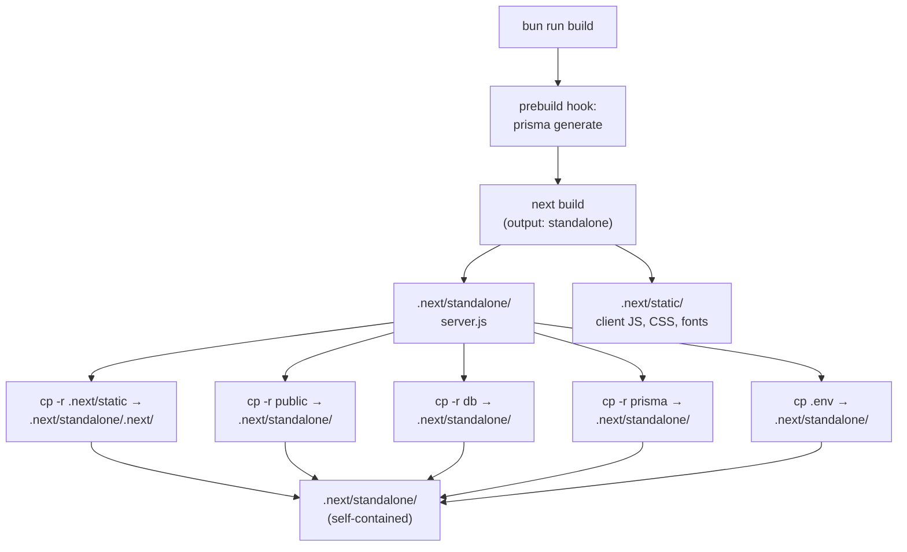

# Deployment

How Black Orchid is built, bundled, and run in production.

> **Source of truth**
> - `package.json` — `build`, `start`, `prebuild` scripts
> - `next.config.ts` — `output: "standalone"`
> - `.env` — `DATABASE_URL`, `ADMIN_JWT_SECRET`
> - `Caddyfile` — reverse proxy / gateway configuration
> - `prisma/schema.prisma` — SQLite datasource

---

## 1. Build Pipeline

### 1.1 What happens when you run `bun run build`



### 1.2 The build script

From `package.json`:

```json
{
  "prebuild": "prisma generate",
  "build": "next build && cp -r .next/static .next/standalone/.next/ && cp -r public .next/standalone/ && cp -r db .next/standalone/ && cp -r prisma .next/standalone/ && cp .env .next/standalone/"
}
```

| Step | Purpose |
| --- | --- |
| `prisma generate` (`prebuild`) | Regenerates the Prisma Client from `prisma/schema.prisma`. Ensures the bundled client matches the current schema. |
| `next build` | Compiles the Next.js 16 app. Because `output: "standalone"` is set in `next.config.ts`, Next.js produces a minimal Node.js server at `.next/standalone/server.js` plus the client assets in `.next/static/`. |
| `cp -r .next/static .next/standalone/.next/` | The standalone server needs the client JS/CSS/font chunks to serve them. The standalone bundle does **not** include these by default. |
| `cp -r public .next/standalone/` | Static assets: 44 WebP images, hero video, `robots.txt`, `logo.svg`, and the runtime `uploads/` directory. |
| `cp -r db .next/standalone/` | The SQLite database file (`db/custom.db`). Without this, the production server has no database. |
| `cp -r prisma .next/standalone/` | The Prisma schema. Needed if you want to run migrations on the production server. |
| `cp .env .next/standalone/` | Environment variables. The standalone server reads this on startup. |

### 1.3 Why `output: "standalone"`?

Next.js 16's standalone output mode bundles only the code needed to run the app into a minimal `server.js`, plus a trimmed `node_modules`. This produces a deployment artifact that:

- Has no dev dependencies
- Is smaller than a full `node_modules`
- Runs with just `node .next/standalone/server.js` (no `next start` needed)
- Is ideal for Docker images, VMs, and serverless runtimes

The trade-off: the standalone bundle doesn't include static assets or the database, so we copy them in manually (the `cp` commands above).

### 1.4 Other `next.config.ts` settings

```ts
const nextConfig: NextConfig = {
  output: "standalone",
  typescript: { ignoreBuildErrors: true },
  reactStrictMode: false,
};
```

- `typescript.ignoreBuildErrors: true` — the build does not fail on TypeScript errors. This is intentional for the sandbox dev environment (some third-party type mismatches exist). **For a stricter production setup, set this to `false`** and resolve all type errors before deploying.
- `reactStrictMode: false` — disabled because GSAP contexts and Framer Motion `useScroll` produce double-effect warnings in StrictMode that don't reflect real bugs.

---

## 2. Production Server

### 2.1 Starting the server

```bash
bun run start
```

This runs:

```bash
NODE_ENV=production bun .next/standalone/server.js 2>&1 | tee server.log
```

- `NODE_ENV=production` — enables React production builds, disables dev warnings
- `bun .next/standalone/server.js` — runs the standalone Node.js server
- `2>&1 | tee server.log` — captures all output to `server.log`

The server listens on **port 3000** by default (Next.js standalone default).

### 2.2 Changing the port

```bash
PORT=4000 bun .next/standalone/server.js
```

Or modify the `start` script in `package.json`.

> The sandbox gateway expects port 3000. If you change the port, update `Caddyfile` to match.

### 2.3 Process management

For a real production deployment, run the standalone server behind a process manager so it restarts on crash:

```bash
# Using PM2
pm2 start .next/standalone/server.js --name black-orchid

# Using systemd (Linux)
[Unit]
Description=Black Orchid
After=network.target

[Service]
Type=simple
User=www-data
WorkingDirectory=/var/www/black-orchid
ExecStart=/usr/bin/bun /var/www/black-orchid/.next/standalone/server.js
Restart=on-failure
Environment=NODE_ENV=production

[Install]
WantedBy=multi-user.target
```

---

## 3. Environment Variables

### 3.1 Required

| Variable        | Production value                              | Notes |
| --------------- | --------------------------------------------- | --- |
| `DATABASE_URL`  | `file:./db/custom.db` (relative) or `file:/var/www/black-orchid/db/custom.db` (absolute) | Path to the SQLite file inside the standalone bundle. **Must be writable by the Node process.** |

> Use a **relative** path (`file:./db/custom.db`) when possible. The standalone server's working directory is `.next/standalone/`, so a relative path resolves correctly regardless of where the bundle is deployed. The current sandbox uses an absolute path (`file:/home/z/my-project/db/custom.db`) because the dev server runs from the project root.

### 3.2 Optional but recommended

| Variable             | Production value                | Notes |
| -------------------- | ------------------------------- | --- |
| `ADMIN_JWT_SECRET`   | A 32+ character random string   | HS256 signing secret for admin JWTs. **Set this.** If unset, `src/lib/auth.ts` falls back to `"black-orchid-dev-secret-change-me"`, which is insecure. |
| `PORT`               | `3000` (or your preferred port) | Defaults to 3000 if unset. |

### 3.3 Generating a secret

```bash
openssl rand -base64 32
```

Set it in `.next/standalone/.env` (or as a real environment variable on the host).

---

## 4. Static Assets

### 4.1 What's served

The standalone server serves everything in `.next/standalone/public/` as static files:

| Path                          | Contents                                |
| ----------------------------- | --------------------------------------- |
| `/img/*.webp`                 | 44 compressed WebP images (version-controlled) |
| `/uploads/*`                  | Admin-uploaded images (runtime, writable) |
| `/hero-video.mp4`             | 2.4 MB cinematic hero background        |
| `/logo.svg`                   | Site logo                               |
| `/robots.txt`                 | SEO crawler directives                  |
| `/_next/static/*`             | Client JS chunks, CSS, fonts (from `.next/static/`) |

### 4.2 The `uploads/` directory

`public/uploads/` is the **writable** upload destination. The Node process must have write permission:

```bash
mkdir -p .next/standalone/public/uploads
chmod 755 .next/standalone/public/uploads
```

If this directory is missing or not writable, admin image uploads will fail with a 500 error.

### 4.3 Persistence across rebuilds

The `bun run build` step does `cp -r public .next/standalone/`, which **overwrites** but does not delete. So:

- A rebuild preserves existing `public/uploads/` files (they're copied over).
- A fresh `git clone` + `bun run build` will **not** have any uploaded files (they're not in git).

For production, treat `public/uploads/` as **stateful data** — back it up separately from the code.

---

## 5. Database

### 5.1 SQLite file location

The database is a single file at `db/custom.db` (path set by `DATABASE_URL`). It is copied into `.next/standalone/db/custom.db` during the build.

### 5.2 Backups

Because SQLite is a single file, backing up is trivial:

```bash
# Cold backup (stop the server first to avoid corruption)
bun run start --stop   # or kill the process
cp .next/standalone/db/custom.db /backups/custom-$(date +%Y%m%d).db
bun run start

# Hot backup (using sqlite3 CLI — safe while server is running)
sqlite3 .next/standalone/db/custom.db ".backup /backups/custom-$(date +%Y%m%d).db"
```

Schedule daily backups via cron.

### 5.3 Concurrency limitations

SQLite is a file-based database. It handles **concurrent reads well** but serialises writes. For a single-server restaurant website with low admin traffic, this is fine. For higher concurrency (e.g. hundreds of reservations per minute), migrate to PostgreSQL — see [ROADMAP.md](./ROADMAP.md).

### 5.4 Migrating to PostgreSQL

```prisma
// prisma/schema.prisma
datasource db {
  provider = "postgresql"   // was "sqlite"
  url      = env("DATABASE_URL")
}
```

Then:
```bash
bun run db:migrate
bun prisma/seed.ts
```

> ⚠️ The current schema uses `String @default("[]")` for JSON-array fields (because SQLite has no native array type). PostgreSQL supports `String[]` natively, but migrating would require schema + seed + API route changes (the JSON.parse/JSON.stringify calls in `src/app/api/menu/route.ts` etc. would need to be removed). See [DATABASE.md](./DATABASE.md) for details.

---

## 6. Domain & HTTPS

### 6.1 Reverse proxy

The sandbox uses **Caddy** as a reverse proxy / gateway (see `Caddyfile`). Caddy:

1. Terminates TLS (auto-provisions Let's Encrypt certificates).
2. Forwards requests to the Next.js standalone server on port 3000.
3. Serves as the single externally-exposed port.

For a real deployment, use Caddy, Nginx, or your cloud provider's load balancer. A minimal Caddyfile:

```caddy
blackorchid.com {
    reverse_proxy localhost:3000

    # Static asset caching
    @static path /_next/static/* /img/* /uploads/* /hero-video.mp4
    header @static Cache-Control "public, max-age=31536000, immutable"

    # Gzip / brotli
    encode gzip zstd
}
```

### 6.2 Nginx equivalent

```nginx
server {
    listen 443 ssl http2;
    server_name blackorchid.com;

    ssl_certificate     /etc/letsencrypt/live/blackorchid.com/fullchain.pem;
    ssl_certificate_key /etc/letsencrypt/live/blackorchid.com/privkey.pem;

    location / {
        proxy_pass http://127.0.0.1:3000;
        proxy_set_header Host $host;
        proxy_set_header X-Real-IP $remote_addr;
        proxy_set_header X-Forwarded-For $proxy_add_x_forwarded_for;
        proxy_set_header X-Forwarded-Proto $scheme;
    }

    location /_next/static/ {
        proxy_pass http://127.0.0.1:3000;
        expires 1y;
        add_header Cache-Control "public, immutable";
    }
}

server {
    listen 80;
    server_name blackorchid.com;
    return 301 https://$host$request_uri;
}
```

### 6.3 HTTPS requirements

- The admin JWT cookie (`bo_admin_token`) is set with `sameSite: "lax"` but **not** `secure: true` — see `src/app/api/admin/login/route.ts`. For production over HTTPS, **add `secure: true`** to the cookie options so the cookie isn't sent over plain HTTP.
- All API requests use **relative paths** (`/api/menu`, not `http://localhost:3000/api/menu`), so they inherit the origin protocol — no CORS configuration needed.

---

## 7. Docker (Roadmap)

There is **no Dockerfile** today. The roadmap includes containerising the standalone build. A minimal `Dockerfile` would look like:

```dockerfile
# Build stage
FROM oven/bun:1 AS build
WORKDIR /app
COPY package.json bun.lock ./
RUN bun install --frozen-lockfile
COPY . .
RUN bun run build

# Production stage
FROM oven/bun:1 AS prod
WORKDIR /app
COPY --from=build /app/.next/standalone ./
COPY --from=build /app/.next/standalone/public ./public
EXPOSE 3000
ENV NODE_ENV=production
ENV PORT=3000
CMD ["bun", "server.js"]
```

> The `bun run build` script already copies `public/`, `db/`, `prisma/`, `.env` into `.next/standalone/`, so the production stage just needs the standalone directory. The explicit `COPY` of `public` above is for clarity.

Caveats:
- **Database persistence:** SQLite inside a container is ephemeral. Mount a volume: `-v black-orchid-db:/app/db` and `-v black-orchid-uploads:/app/public/uploads`.
- **Secret management:** Don't bake `ADMIN_JWT_SECRET` into the image. Pass it as an env var at runtime: `docker run -e ADMIN_JWT_SECRET=... black-orchid`.

---

## 8. Deployment Checklist

Before promoting a build to production:

- [ ] `bun run lint` passes with 0 errors
- [ ] `bun run build` succeeds
- [ ] `ADMIN_JWT_SECRET` is set to a strong random value (not the dev default)
- [ ] `DATABASE_URL` points to a writable SQLite file location
- [ ] `public/uploads/` exists and is writable by the Node process
- [ ] Reverse proxy (Caddy/Nginx) forwards to port 3000
- [ ] TLS certificate is provisioned (Let's Encrypt via Caddy, or your provider)
- [ ] `secure: true` is added to the JWT cookie options in `src/app/api/admin/login/route.ts`
- [ ] Backups are scheduled for `db/custom.db` and `public/uploads/`
- [ ] Default admin password (`admin123`) has been changed via Admin → Change Password
- [ ] Lighthouse score is 90+ on all four categories

---

## 9. Zero-Downtime Deployments (Roadmap)

The current setup restarts the standalone server to deploy a new build, causing a brief downtime. For zero-downtime:

1. Run two instances on different ports (3000, 3001).
2. Use Caddy's `reverse_proxy` with health checks to drain and switch.
3. Or use a process manager like PM2 with `reload` (graceful restart).

This is on the roadmap but not yet implemented.

---

## 10. Related Documentation

- [ENVIRONMENT_SETUP.md](./ENVIRONMENT_SETUP.md) — Local development setup
- [DATABASE.md](./DATABASE.md) — Prisma schema, migrations, backups
- [IMAGE_STORAGE.md](./IMAGE_STORAGE.md) — `public/uploads/` persistence and backups
- [AUTHENTICATION.md](./AUTHENTICATION.md) — JWT cookie options (add `secure: true` for production)
- [KNOWN_ISSUES.md](./KNOWN_ISSUES.md) — SQLite concurrency, no Docker, etc.
- [ROADMAP.md](./ROADMAP.md) — Docker, PostgreSQL, zero-downtime
