# Roadmap

The planned evolution of Black Orchid, organised by horizon.

> **Principles**
> - Every item here is **not yet implemented** (or is a documented limitation in [KNOWN_ISSUES.md](./KNOWN_ISSUES.md)).
> - Priorities shift based on real usage — this document is a plan, not a commitment.
> - Each item links to the relevant doc for context.

---

## Horizon Overview

```mermaid
flowchart LR
    subgraph Short["Short-term (next quarter)"]
        S1["sitemap.xml"]
        S2["schema.org JSON-LD"]
        S3["Email notifications"]
        S4["Pagination"]
        S5["Remove misleading 'email sent' text"]
    end
    subgraph Medium["Medium-term (next 6 months)"]
        M1["PostgreSQL migration"]
        M2["Docker setup"]
        M3["Automated tests<br/>Vitest + Playwright"]
        M4["Role-based access"]
        M5["Analytics integration"]
        M6["secure cookie flag"]
    end
    subgraph Long["Long-term (12+ months)"]
        L1["Multi-language (i18n)"]
        L2["Online ordering"]
        L3["Payment integration"]
        L4["Mobile app"]
        L5["AI chatbot for reservations"]
        L6["Per-view routes<br/>(replace hash routing)"]
    end
    Short --> Medium --> Long
```

---

## Short-term (Next Quarter)

Quick wins that close existing gaps without architectural changes.

### S1. Add `sitemap.xml`

- **Why:** Google Search Console reports no sitemap. The site is indexed but discovery is suboptimal.
- **How:** Create `src/app/sitemap.ts` using Next.js 16's `MetadataRoute.Sitemap` API. See [SEO.md](./SEO.md) §5.
- **Effort:** Small (1 file, ~20 lines).
- **Caveat:** Hash URLs (`/#menu`) are not ideal sitemap entries. Consider pairing with S6 (per-view routes) for full value.

### S2. Add schema.org structured data (JSON-LD)

- **Why:** Eligibility for rich results (Restaurant, Menu, Event, BreadcrumbList) in Google Search.
- **How:** Add a `<script type="application/ld+json">` block in `src/app/layout.tsx`, sourced from `SiteSettings`. See [SEO.md](./SEO.md) §6.
- **Effort:** Small (1 block in layout, ~30 lines).
- **Schema types:** `Restaurant`, `WebSite`, `BreadcrumbList`. Optionally `Menu` / `MenuItem` and `Event`.

### S3. Email notifications for reservations

- **Why:** The success screen says "A confirmation email is on its way" but no email is sent — see [KNOWN_ISSUES.md](./KNOWN_ISSUES.md) §9.
- **How:**
  1. Pick an email provider (Resend recommended — simple API, generous free tier).
  2. Add `src/lib/email.ts` with a `sendReservationConfirmation(email, reservation)` helper.
  3. Call it from `POST /api/reservations` after the DB row is created.
  4. Build an HTML email template matching the Black Orchid brand (dark + gold, Playfair heading).
- **Effort:** Medium (new dependency, email template, provider account setup).
- **Also:** Add admin notification emails (new reservation received).

### S4. Pagination for menu/gallery

- **Why:** Loading all items at once doesn't scale — see [KNOWN_ISSUES.md](./KNOWN_ISSUES.md) §10.
- **How:**
  1. Add `?page=1&limit=12` query params to `GET /api/gallery` (and optionally `GET /api/menu`).
  2. Update `GalleryView`'s "Load More" button to fetch the next page instead of revealing hidden items.
  3. Return total count in the response for "Showing X of Y" UI.
- **Effort:** Small-medium (API + client changes, ~50 lines per route).
- **Caveat:** Menu is grouped by category — pagination is more natural per-category than globally.

### S5. Remove or fix the misleading "email sent" text

- **Why:** Until S3 is done, the success screen lies to the user.
- **How:** Either remove the "A confirmation email is on its way" line, or replace with "Our team will confirm your reservation shortly."
- **Effort:** Trivial (1 line in `ReservationView.tsx`).
- **Priority:** High — should be done immediately if S3 slips.

### S6. (Stretch) Promote hash views to real routes

- **Why:** `/#menu` is not a separate URL for search engines, sitemaps, or social sharing. Real routes (`/menu`, `/gallery`, …) would make SEO, analytics, and deep-linking far more powerful.
- **How:** Move from Zustand hash routing to Next.js App Router file-based routing (`src/app/menu/page.tsx`, etc.). Keep the liquid-glass page transition by mounting it in `layout.tsx`.
- **Effort:** Large (architectural change — touches every view, the store, the page transition logic).
- **Trade-off:** Loses the instant view-switching feel of the SPA. May need to keep an SPA shell for the cinematic experience and use real routes only for SEO-critical pages.

---

## Medium-term (Next 6 Months)

Architectural improvements that enable scale and reliability.

### M1. PostgreSQL migration

- **Why:** SQLite's write concurrency ceiling — see [KNOWN_ISSUES.md](./KNOWN_ISSUES.md) §8.
- **How:**
  1. Change `datasource db { provider = "postgresql" }` in `prisma/schema.prisma`.
  2. Replace `String @default("[]")` JSON-array fields with `String[]` native arrays.
  3. Update API routes to stop `JSON.parse`/`JSON.stringify`-ing those fields.
  4. Update the seed script.
  5. Run `bun run db:migrate` against a fresh PostgreSQL instance.
- **Effort:** Medium (schema + ~6 API routes + seed + types).
- **Also:** Document the migration path for existing SQLite deployments (data export → transform → import).
- **See:** [DATABASE.md](./DATABASE.md), [DEPLOYMENT.md](./DEPLOYMENT.md) §5.4.

### M2. Docker setup

- **Why:** Reproducible builds, easy preview instances, CI/CD readiness.
- **How:**
  1. Create a `Dockerfile` (multi-stage: build with Bun, run with Bun or Node).
  2. Create `docker-compose.yml` with a volume for `db/` and `public/uploads/`.
  3. Add a `.dockerignore`.
  4. Document the deployment workflow.
- **Effort:** Small (sample Dockerfile in [DEPLOYMENT.md](./DEPLOYMENT.md) §7).
- **See:** [DEPLOYMENT.md](./DEPLOYMENT.md) §7.

### M3. Automated tests (Vitest + Playwright)

- **Why:** Catch regressions before they ship. Enable confident refactors.
- **How:**
  1. Add Vitest for unit tests (`src/lib/*.test.ts`) and API integration tests (`src/app/api/**/route.test.ts`).
  2. Add Playwright for E2E tests (`e2e/*.spec.ts`) covering the critical user journeys (login, reservation, CRUD).
  3. Add a `test` script to `package.json`.
  4. Wire into CI (GitHub Actions).
- **Effort:** Medium (framework setup + writing the first 20–30 tests).
- **See:** [TESTING.md](./TESTING.md) §6.

### M4. Role-based access enforcement

- **Why:** The schema defines `ADMIN` / `MANAGER` / `EDITOR` roles but they're not enforced — see [KNOWN_ISSUES.md](./KNOWN_ISSUES.md) §4.
- **How:**
  1. Extend `requireAdmin(req, allowedRoles)` in `src/lib/auth.ts`.
  2. Add role checks to sensitive routes (settings, delete operations = ADMIN only; content edits = EDITOR+; reservations = MANAGER+).
  3. Add an admin UI for creating/managing additional admin users.
  4. Hide admin nav items based on the current user's role.
- **Effort:** Medium (auth lib + ~10 route updates + new admin section).
- **See:** [AUTHENTICATION.md](./AUTHENTICATION.md).

### M5. Analytics integration

- **Why:** The admin Overview shows a hardcoded `visitors: 12840` placeholder. Real analytics would inform business decisions.
- **How:**
  1. Pick an analytics provider (Plausible recommended — privacy-friendly, no cookies, simple).
  2. Add the tracking script to `src/app/layout.tsx`.
  3. Replace the hardcoded `visitors` count in `GET /api/stats` with a real fetch from the analytics API.
  4. Optionally add per-page view tracking (will require per-view routes — see S6).
- **Effort:** Small (script tag + 1 API update).
- **Alternative:** Google Analytics 4, Vercel Analytics, Umami.

### M6. Set `secure: true` on the JWT cookie

- **Why:** The `bo_admin_token` cookie is set with `sameSite: "lax"` but not `secure: true` — over plain HTTP, the cookie could be intercepted.
- **How:** In `src/app/api/admin/login/route.ts`, add `secure: true` to the cookie options. Ensure the production deployment is HTTPS-only (the reverse proxy should redirect HTTP → HTTPS).
- **Effort:** Trivial (1 line).
- **See:** [DEPLOYMENT.md](./DEPLOYMENT.md) §6.3, [AUTHENTICATION.md](./AUTHENTICATION.md).

### M7. (Stretch) Image optimisation pipeline

- **Why:** Uploaded images keep their original format (PNG, JPEG) and size. A 6 MB upload is served as-is.
- **How:**
  1. In `POST /api/upload`, run the uploaded file through Sharp to convert to WebP, resize to max 1200px, and set quality to 78 (matching the static image pipeline).
  2. Store the optimised WebP instead of the original.
- **Effort:** Small (Sharp is already a dependency).
- **See:** [IMAGE_STORAGE.md](./IMAGE_STORAGE.md) §11.

### M8. (Stretch) Rate limiting on auth + reservation endpoints

- **Why:** No rate limiting exists — see [API_REFERENCE.md](./API_REFERENCE.md) §"Rate Limiting". The login endpoint is the most exposed.
- **How:**
  1. At the gateway (Caddy `rate_limit` directive), OR
  2. In-app via a simple in-memory rate limiter (sufficient for single-server), OR
  3. Via an Upstash Redis counter (if multi-instance).
- **Effort:** Small.

---

## Long-term (12+ Months)

Strategic bets that expand the product surface.

### L1. Multi-language support (i18n)

- **Why:** Reach a broader audience (e.g. French, Arabic, Mandarin for a luxury tourism market).
- **How:** `next-intl` is already installed. Wire it up:
  1. Define message catalogs (`messages/en.json`, `messages/fr.json`, …).
  2. Add a locale switcher to the navbar.
  3. Localise all UI strings + the seeded content (menu descriptions, about body, etc.).
  4. Localise the admin CMS too (or keep it English-only).
- **Effort:** Large (catalogs for ~500 strings, content translation, RTL support if Arabic).
- **See:** `next-intl` is already in `package.json` (installed but not used).

### L2. Online ordering

- **Why:** Beyond reservations — let guests order takeout or delivery.
- **How:**
  1. Add a `Order` model (similar to `Reservation` but with `OrderItem[]`).
  2. Add a cart UI to the menu view.
  3. Add a checkout flow (pickup vs delivery, address, time slot).
  4. Integrate a payment provider (see L3).
  5. Add an `AdminOrders` section.
- **Effort:** Large (new domain model, new public flow, new admin section, payment integration).
- **Risk:** Shifts the brand from "fine dining" to "transactional" — must be done carefully to preserve luxury positioning (e.g. "Curated takeaway" not "Delivery").

### L3. Payment integration

- **Why:** Enable deposits for banquet bookings, pre-paid tasting menus, or online ordering.
- **How:**
  1. Pick a provider (Stripe recommended — mature, well-documented).
  2. Add a `Payment` model.
  3. Use Stripe Checkout (hosted page) for simplicity, or Stripe Elements (embedded) for control.
  4. Webhook handler to confirm payment → update reservation status.
- **Effort:** Medium-large (Stripe integration, webhook handling, refund flow).
- **Compliance:** PCI DSS — using Stripe Checkout/Elements keeps you out of PCI scope.

### L4. Mobile app

- **Why:** A branded mobile app for loyal patrons (push notifications for events, one-tap reservation, digital membership card).
- **How:**
  1. React Native (Expo) — reuse the design system tokens.
  2. Share the API with the web app.
  3. Add push notifications (Expo Notifications + FCM/APNs).
- **Effort:** Very large (new platform, new build pipeline, app store review).
- **Alternative:** A high-quality PWA (installable, offline-capable) may deliver 80% of the value at 20% of the cost.

### L5. AI chatbot for reservations

- **Why:** Let guests book a table via natural language ("Table for 4 this Friday at 8pm, window seat if possible").
- **How:**
  1. Use an LLM (the project already has `z-ai-web-dev-sdk` available) to parse natural-language booking requests.
  2. Map the parsed intent to the existing `POST /api/reservations` flow.
  3. Add a chat widget to the public site (bottom-right, replacing or alongside the sticky Reserve CTA).
  4. Optionally handle FAQ ("What time do you close?", "Do you have vegan options?") by querying the live menu/settings.
- **Effort:** Medium (LLM integration + chat UI + intent parsing).
- **Caveat:** Must feel luxurious, not gimmicky. The chat should be branded (Black Orchid voice) and visually consistent with the site.

### L6. Per-view routes (replace hash routing)

- **Why:** Real routes (`/menu`, `/gallery`, `/reservation`) enable proper SEO, sitemap, analytics, and deep-linking — see S6.
- **How:** Move from Zustand hash routing to Next.js App Router file-based routing. Each view becomes `src/app/<view>/page.tsx`.
- **Effort:** Large (architectural — touches the store, page transitions, every view).
- **Trade-off:** Must preserve the cinematic liquid-glass page transition. This can be done with a custom `layout.tsx` + `usePathname()` + AnimatePresence.
- **See:** [ROUTING.md](./ROUTING.md), [STATE_MANAGEMENT.md](./STATE_MANAGEMENT.md).

---

## Backlog (Unscheduled)

Items worth considering but not yet committed to a horizon:

- **Admin user management UI** (currently only the seed creates admins)
- **Banquet enquiry form** (currently routes to the reservation flow)
- **Newsletter signup** (the footer has a newsletter band but it's decorative)
- **Gift card purchases** (requires payment integration — L3)
- **Loyalty program** (track visits, offer perks)
- **Private dining room booking** (separate from general reservations)
- **Menu PDF export** (generate a branded PDF of the current menu)
- **Reservation calendar view** in admin (currently a list)
- **SMS reminders** for upcoming reservations (Twilio integration)
- **Waitlist** for fully-booked time slots
- **Table management** (assign reservations to specific tables)
- **Kitchen display system** integration (send orders to the kitchen)

---

## Done (Already Shipped)

For reference, features that were on the roadmap and are now complete:

- ✅ bcrypt password hashing (replaced scrypt)
- ✅ JWT auth with httpOnly cookie
- ✅ Image upload to disk (not Base64)
- ✅ Compressed WebP static images (44 files)
- ✅ Premium animations (GSAP, Lenis, SplitType)
- ✅ Liquid glass page transitions
- ✅ Context-aware custom cursor
- ✅ Magnetic buttons
- ✅ Film grain overlay
- ✅ PillNav (replaced the original sticky navbar)
- ✅ OptionWheel + CircularGallery components
- ✅ DishShowcase modal
- ✅ 5-step reservation wizard (was 3-step, expanded)
- ✅ Mobile sticky CTA
- ✅ Standalone build with db/prisma/public/.env copied in
- ✅ Hash navigation fix (direct URL with `#hash` now lands on the right view)
- ✅ ScrollStack removed (replaced with simple GSAP fade-up grid)
- ✅ Password change feature (admin can change their own password)

See [CHANGELOG.md](./CHANGELOG.md) for the full implementation history.

---

## Related Documentation

- [KNOWN_ISSUES.md](./KNOWN_ISSUES.md) — Current limitations (links to roadmap items)
- [SEO.md](./SEO.md) — Sitemap + structured data details
- [TESTING.md](./TESTING.md) §6 — Test framework roadmap
- [DEPLOYMENT.md](./DEPLOYMENT.md) — Docker + PostgreSQL migration
- [DATABASE.md](./DATABASE.md) — SQLite → PostgreSQL path
