# Testing

The current testing approach for Black Orchid, plus the manual checklist and roadmap.

> **Source of truth**
> - No test files exist in the codebase (`rg "describe\(|test\(|it\(" src/` returns nothing)
> - `package.json` has no `test` script
> - Manual testing is performed via the browser and the Agent Browser automation tool

---

## 1. Current Approach

Black Orchid currently has **no automated tests** — no unit tests, no integration tests, no end-to-end tests. There is no `test` script in `package.json`, no test framework installed (no Jest, Vitest, Playwright, or Cypress), and no `__tests__` directories.

All testing is **manual**, performed by:

1. **The developer** — running `bun run dev`, clicking through views, exercising the admin CMS.
2. **Agent Browser** — a headless browser automation tool used for E2E-style smoke tests (navigating pages, taking screenshots, verifying flows).

### Why no automated tests (yet)

The project prioritised rapid iteration on the cinematic UX and admin CMS. Adding tests now is on the roadmap (see §6) — but the manual process has been sufficient to ship each feature with confidence.

---

## 2. Manual Test Checklist

Run through this checklist before considering any change "done".

### 2.1 Public Site

#### Navigation
- [ ] Clicking each `PillNav` item switches to the correct view (`home`, `about`, `menu`, `banquet`, `gallery`, `catering`, `hours`, `contact`, `reservation`)
- [ ] The URL hash updates (`#menu`, `#gallery`, …) and is shareable
- [ ] Refreshing the page on a hash (`/#menu`) lands on the correct view
- [ ] The liquid-glass page transition plays on every view change
- [ ] The footer links (`Privacy`, `Terms`, `Admin`) work
- [ ] The sticky "Reserve" CTA in the bottom-right is visible on mobile and scrolls to top on click

#### Home
- [ ] Hero video loads and autoplays (muted, looped)
- [ ] Headline reveals word-by-word on scroll
- [ ] "Signature Dishes" section shows up to 4 featured items
- [ ] "Story" section has a parallax image and floating stat card
- [ ] Testimonials carousel rotates
- [ ] Circular gallery scrolls horizontally

#### Menu
- [ ] All 6 categories appear as pills
- [ ] Selecting a category filters items
- [ ] Search filters items by name/description
- [ ] Veg-only toggle filters vegetarian items
- [ ] Clicking a dish opens the `DishShowcase` modal
- [ ] Modal shows images, ingredients, allergens, serving size

#### Gallery
- [ ] All 5 category filters work (`All`, `Food`, `Drinks`, `Interior`, `Events`, `Banquet`)
- [ ] Masonry layout renders without overlap
- [ ] Clicking an image opens the lightbox
- [ ] Lightbox next/prev navigation wraps around
- [ ] "Load More" reveals additional images (if any)

#### Reservation
- [ ] Step 1 validates name (≥2 chars), phone (≥7 digits), email (regex)
- [ ] Step 2 date picker doesn't allow past dates
- [ ] Time slot selection works (Lunch + Dinner groups)
- [ ] Guest stepper increments/decrements (1–20)
- [ ] Step 3 review card shows all entered details
- [ ] Submit creates a reservation (check Admin → Reservations)
- [ ] Success screen shows the animated gold check
- [ ] "Make Another Reservation" resets the form

#### Other Views
- [ ] **About** — parallax image, stats band, philosophy section
- [ ] **Banquet** — showcase grid, amenities cards, CTA
- [ ] **Catering** — 3 packages (middle highlighted), features lists, process steps
- [ ] **Hours** — 7-day table with today highlighted
- [ ] **Contact** — info rows, social icons, form (800ms simulated submit), map iframe
- [ ] **Privacy** — 6 content blocks render
- [ ] **Terms** — 6 content blocks render

### 2.2 Admin CMS

#### Login
- [ ] `/admin` shows the login screen
- [ ] Wrong password → 401 error displayed
- [ ] Correct credentials (`admin@blackorchid.com` / `admin123`) → dashboard
- [ ] Session persists across page refresh (localStorage hydration)

#### Overview
- [ ] Stats card shows reservation/menu/gallery counts
- [ ] Weekly reservations chart renders (Recharts)
- [ ] Recent reservations list shows latest 6
- [ ] Clicking a stat card navigates to the relevant section

#### Reservations
- [ ] List loads with status filter (`ALL`, `PENDING`, `CONFIRMED`, `CANCELLED`, `COMPLETED`)
- [ ] Status change persists (PATCH)
- [ ] Delete works with confirmation
- [ ] Empty state shows when no reservations match the filter

#### Menu
- [ ] Categories list with item counts
- [ ] Add new category
- [ ] Add new menu item — all 4 sections (Essentials, Imagery, Dietary, Ingredients & Allergens)
- [ ] Multi-image uploader: drag/drop, replace, delete, reorder, paste URL
- [ ] Tag inputs for ingredients/allergens (Enter to add, Backspace to remove, quick-add pills)
- [ ] Edit existing item — all fields populate
- [ ] Delete item
- [ ] "Chef's Pick" badge appears when `chefRecommended` is true

#### Gallery
- [ ] Grid of images with category badges
- [ ] Add new image (upload + metadata)
- [ ] Edit title/caption/category
- [ ] Delete image

#### Testimonials
- [ ] List with avatars and ratings
- [ ] Add new testimonial
- [ ] Toggle `featured` (affects Home page carousel)
- [ ] Edit/delete

#### Events
- [ ] List of events
- [ ] Add new event with image
- [ ] Publish/unpublish toggle
- [ ] Delete

#### Catering
- [ ] 3 packages shown
- [ ] Add/edit/delete package
- [ ] Features (pipe-separated) render as bullet list on the public site

#### Settings
- [ ] All 20+ fields editable
- [ ] Save persists (PUT)
- [ ] Changes reflect on the public site (hero title, about body, hours, contact info, social links)

#### Change Password
- [ ] Wrong current password → 403
- [ ] New password < 8 chars → 400
- [ ] New password === current → 400
- [ ] Successful change signs out the user
- [ ] Re-login with the new password works

### 2.3 Cross-Cutting

#### Mobile Responsive
- [ ] Test on iPhone SE (375px), iPhone 14 (390px), iPad (768px), desktop (1280px+)
- [ ] PillNav collapses to a horizontal scroll on mobile
- [ ] Admin sidebar becomes a drawer on mobile
- [ ] All touch targets are ≥ 44px
- [ ] No horizontal scroll on any view

#### Accessibility
- [ ] Keyboard-only navigation works (Tab, Enter, Escape)
- [ ] Focus rings are visible
- [ ] Screen reader announces headings, buttons, images
- [ ] `prefers-reduced-motion: reduce` disables all animations (elements appear immediately)
- [ ] Color contrast meets WCAG AA

#### Performance (Lighthouse)
- [ ] Performance ≥ 90
- [ ] Accessibility ≥ 90
- [ ] Best Practices ≥ 90
- [ ] SEO ≥ 90

---

## 3. Agent Browser E2E Smoke Test

For automated smoke testing, use the Agent Browser tool to script a basic E2E flow:

```mermaid
flowchart LR
    A["Navigate to /"] --> B["Wait for hero video"]
    B --> C["Click 'Menu' in PillNav"]
    C --> D["Wait for menu items"]
    D --> E["Click first dish → modal opens"]
    E --> F["Close modal"]
    F --> G["Click 'Reserve' CTA"]
    G --> H["Fill step 1 → Continue"]
    H --> I["Fill step 2 → Continue"]
    I --> J["Submit step 3"]
    J --> K["Verify success screen"]
    K --> L["Navigate to /admin"]
    L --> M["Login"]
    M --> N["Verify reservations list shows new entry"]
```



Each step should:
1. Wait for the element to be visible (animation complete).
2. Take a screenshot for regression comparison.
3. Assert the expected state (text content, URL hash, element presence).

> Agent Browser is configured in the sandbox. See the project's `agent-ctx/` directory for past E2E run records.

---

## 4. Regression Testing

After every change (especially to shared components like `primitives.tsx`, `motion.tsx`, `premium-motion.ts`, or `gsap-utils.ts`), verify that **existing features still work**:

1. **Run the manual checklist** for the affected area (public site, admin, or both).
2. **Take before/after screenshots** of the affected views.
3. **Check the dev log** for new errors or warnings: `tail -n 200 dev.log`.
4. **Run `bun run lint`** — must pass with 0 errors.

### High-risk changes

These files affect the entire app — test everything after touching them:

| File | Why it's risky |
| --- | --- |
| `src/app/layout.tsx` | Affects every route (fonts, metadata, body classes) |
| `src/app/globals.css` | Affects every component's styling |
| `src/lib/store.ts` | Zustand store — affects view routing + admin session |
| `src/lib/auth.ts` | JWT signing/verification — affects all admin APIs |
| `src/lib/api.ts` | All client-side API calls |
| `src/components/site/primitives.tsx` | Used by every public view |
| `src/components/site/motion.tsx` | Used by every public view |
| `src/components/site/premium-motion.ts` | Lenis, page transitions, SplitType — global side effects |
| `prisma/schema.prisma` | Database shape — requires `db:push` + dev server restart |
| `src/components/admin/ui.tsx` | All admin form primitives |

---

## 5. Performance Testing

### 5.1 Lighthouse

Run Lighthouse in Chrome DevTools (or via CLI) against the production build:

```bash
# Build for production
bun run build
bun run start &

# Run Lighthouse
npx lighthouse http://localhost:3000 \
  --output html \
  --output-path ./lighthouse-report.html \
  --preset=desktop \
  --chrome-flags="--headless"
```

### 5.2 Targets

| Category        | Target | Current (estimated) |
| --------------- | ------ | ------------------- |
| Performance     | 90+    | ~90–95 (desktop)    |
| Accessibility   | 90+    | ~90–95              |
| Best Practices  | 90+    | ~95                 |
| SEO             | 90+    | ~90 (no sitemap/JSON-LD yet) |

### 5.3 Key metrics to watch

- **LCP (Largest Contentful Paint)** — the hero video poster. Target < 2.5s.
- **CLS (Cumulative Layout Shift)** — should be ~0 (fixed aspect ratios on all images).
- **TBT (Total Blocking Time)** — Lenis + GSAP + Framer Motion can add up. Target < 200ms.
- **Bundle size** — check `.next/static/chunks/` for unexpectedly large files.

### 5.4 Mobile performance

Mobile is the priority target (mobile-first design). Test on a throttled connection (Slow 4G preset in DevTools) and verify:
- Hero video doesn't block first paint (poster loads first).
- Images lazy-load as you scroll.
- Animations don't jank (target 60fps).

See [PERFORMANCE.md](./PERFORMANCE.md) for the full performance audit.

---

## 6. Roadmap

The plan to introduce automated testing:

### 6.1 Short-term: Unit tests (Vitest)

Add **Vitest** for unit-testing pure functions:

- `src/lib/auth.ts` — `hashPassword`, `verifyPassword`, `signToken`, `verifyToken`
- `src/lib/utils.ts` — `cn()` and any future helpers
- `src/lib/api.ts` — API client (with `fetch` mocked)

```bash
bun add -d vitest @vitest/coverage-v8
```

```ts
// src/lib/auth.test.ts
import { describe, it, expect } from "vitest";
import { signToken, verifyToken } from "./auth";

describe("JWT", () => {
  it("round-trips a token", () => {
    const token = signToken({ sub: "u1", email: "a@b.com", role: "ADMIN" });
    const payload = verifyToken(token);
    expect(payload?.email).toBe("a@b.com");
    expect(payload?.role).toBe("ADMIN");
  });

  it("rejects a tampered token", () => {
    const token = signToken({ sub: "u1", email: "a@b.com", role: "ADMIN" });
    expect(verifyToken(token + "x")).toBeNull();
  });
});
```

### 6.2 Medium-term: API integration tests (Vitest + supertest)

Test the API routes in isolation by invoking the Route Handlers directly:

```ts
import { POST } from "@/app/api/menu/route";

it("rejects unauthenticated POST", async () => {
  const req = new Request("http://localhost/api/menu", { method: "POST", body: "{}" });
  const res = await POST(req);
  expect(res.status).toBe(401);
});
```

### 6.3 Medium-term: E2E tests (Playwright)

Add **Playwright** for browser-driven E2E tests covering the critical user journeys:

```ts
import { test, expect } from "@playwright/test";

test("reservation flow", async ({ page }) => {
  await page.goto("/");
  await page.click("[data-cursor-label='Reserve']");
  await page.fill("input[name=name]", "Jane Doe");
  // ... fill steps 1-3
  await page.click("text=Confirm Reservation");
  await expect(page.locator("text=Reservation Requested")).toBeVisible();
});
```

### 6.4 Visual regression (Roadmap)

Consider **Playwright Visual Comparisons** or **Chromatic** to catch unintended visual changes from CSS/component edits.

### 6.5 CI integration (Roadmap)

Wire tests into GitHub Actions (or equivalent) to run on every PR:

```yaml
# .github/workflows/test.yml
on: [pull_request]
jobs:
  test:
    runs-on: ubuntu-latest
    steps:
      - uses: actions/checkout@v4
      - uses: oven-sh/setup-bun@v1
      - run: bun install
      - run: bun run lint
      - run: bun run db:push
      - run: bun prisma/seed.ts
      - run: bun test            # unit + integration
      - run: bunx playwright test # E2E
```

---

## 7. Test File Conventions (When Added)

When tests are introduced, follow these conventions:

| Type | Location | Naming |
| --- | --- | --- |
| Unit | `src/lib/*.test.ts` | `<file>.test.ts` |
| Component | `src/components/**/*.test.tsx` | `<Component>.test.tsx` |
| API | `src/app/api/**/route.test.ts` | `route.test.ts` |
| E2E | `e2e/*.spec.ts` | `<flow>.spec.ts` |

- Co-locate unit/component tests next to the file they test.
- Put E2E tests in a top-level `e2e/` directory.
- Use `describe`/`it` (Vitest) — not `test` blocks, for readability.
- Mock `db` (Prisma Client) in unit tests; use a real test database in integration tests.

---

## 8. Related Documentation

- [CODING_STANDARDS.md](./CODING_STANDARDS.md) — Patterns that make code testable
- [PERFORMANCE.md](./PERFORMANCE.md) — Lighthouse targets and methodology
- [ACCESSIBILITY.md](./ACCESSIBILITY.md) — A11y testing checklist
- [ROADMAP.md](./ROADMAP.md) — Test framework rollout plan
- [KNOWN_ISSUES.md](./KNOWN_ISSUES.md) — Known quirks to watch for during manual testing
