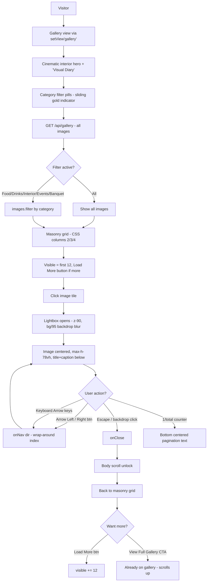
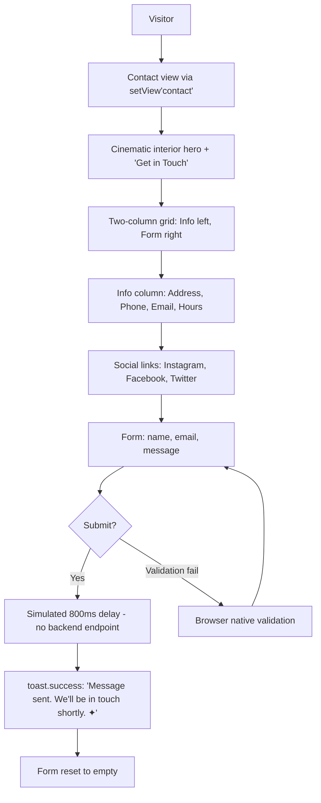
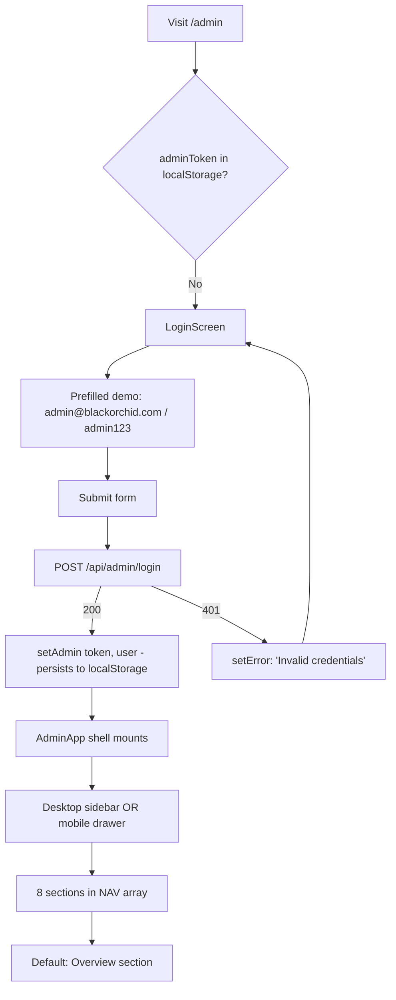
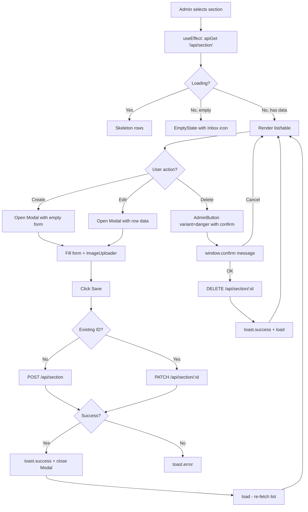

# User Flows — Black Orchid

End-to-end user journeys across the public site, the admin CMS, and the REST API.
All flows reflect the **actual codebase** at `src/components/site/`, `src/components/admin/`,
and `src/app/api/`.

> Routing note: the public site is a single Next.js route (`/`) that swaps 11 views via
> Zustand hash routing (`useApp.setView`) — see `src/lib/store.ts`. Admin lives on `/admin`.

---

## Table of Contents

1. [Reservation Flow](#1-reservation-flow)
2. [Menu Browsing Flow](#2-menu-browsing-flow)
3. [Gallery Flow](#3-gallery-flow)
4. [Catering Inquiry Flow](#4-catering-inquiry-flow)
5. [Contact Flow](#5-contact-flow)
6. [Admin CMS Flow](#6-admin-cms-flow)

---

## 1. Reservation Flow

The flagship public conversion. Implemented in `src/components/site/ReservationView.tsx`
and `src/app/api/reservations/route.ts`.

### Mermaid

```mermaid
flowchart TD
    A[Visitor on any view] --> B[Click 'Reserve a Table' CTA]
    B --> C{Has click origin?}
    C -->|Yes| D[usePageTransition captures x,y,variant]
    D --> E[7-layer liquid glass bloom transition]
    C -->|No| E
    E --> F[ReservationView mounts]
    F --> G[Cinematic hero with ambient orbs]
    G --> H[Step 0: Date — input type=date, min=today]
    H -->|Continue| I[Step 1: Time — Lunch/Dinner groups]
    I -->|Continue| J[Step 2: Guests — stepper 1-20]
    J -->|Continue| K[Step 3: Details — name, phone, email]
    K -->|Continue| L[Step 4: Confirm — summary + special requests]
    L -->|Confirm Reservation| M[POST /api/reservations]
    M -->|201 Created| N[SuccessScreen with animated gold check]
    M -->|400 / 500| O[Toast.error: 'Reservation failed']
    O --> L
    N --> P[Reservation stored with status=PENDING]
    P --> Q[Admin: GET /api/reservations sees new row]
    Q --> R[Admin clicks Confirm / Cancel / Complete]
    R --> S[PATCH /api/reservations/:id {status}]
```

### ASCII — Step Indicator

```
  ●─────●─────●─────●─────●        ← StepDots (9×9 / 10×10 mobile)
  1     2     3     4     5        ← labels
  Date  Time  Guests Details Confirm

  ▓▓▓▓▓▓▓▓▓▓░░░░░░░░░░░░░░░░       ← gold progress fill animates width on step change
```

### Detailed Walkthrough

| Step | Component            | Validates                                                           | Field State                                     |
| ---- | -------------------- | ------------------------------------------------------------------- | ----------------------------------------------- |
| 0    | `StepDate`           | `form.date` non-empty                                               | `<input type="date" min={today}>`               |
| 1    | `StepTime`           | `form.time` non-empty                                               | One of 8 lunch slots or 8 dinner slots          |
| 2    | `StepGuests`         | Always valid (defaults to `"2"`)                                    | `GuestStepper` clamped to `1..MAX_GUESTS (20)`  |
| 3    | `StepDetails`        | name ≥ 2 chars, phone ≥ 7 digits, email regex                       | `PremiumField` wrappers with icon + error text  |
| 4    | `StepConfirm`        | None — review only; special requests optional                       | `SummaryCard` + `<textarea>` for special        |

**On submit** (`submit()`):
- `setLoading(true)`
- `apiPost<Reservation>("/api/reservations", { name, phone, email, date, time, guests:Number, special })`
- On success → `setSuccess(res)` → `<SuccessScreen>` renders an animated SVG gold check
  (`pathLength` draw-in over 0.9s), confirmation reference (last 8 chars of `id`), and a
  "Make Another Reservation" button that calls `reset()` (clears form, returns to step 0).
- On error → `toast.error(err.message)`; user stays on step 4.

**Server side** (`POST /api/reservations`):
- Validates required fields (`name, phone, email, date, time, guests`).
- `db.reservation.create({ data: { ...form, status: "PENDING" } })`.
- Returns `201` with the created reservation (which the client stores as `success`).

**Admin side** (`AdminReservations.tsx`):
- `GET /api/reservations[?status=…]` (admin-only).
- New reservation appears at the top of the table (sorted `createdAt desc` by default).
- Admin can: Confirm → `PATCH {status:"CONFIRMED"}`, Complete → `"COMPLETED"`, Cancel → `"CANCELLED"`,
  or Delete (with `confirm` dialog).

### Transitions & Animations

- Liquid glass page transition (see `usePageTransition` in `premium-motion.ts`).
- Step changes: `framer-motion` `AnimatePresence` with `stepVariants` (slide + fade, 0.4s,
  custom easing `[0.22, 1, 0.36, 1]`).
- Step indicator: animated `motion.div` width transition on the gold progress fill.
- Success check: SVG `motion.circle` + `motion.path` with `pathLength: 0 → 1`.

---

## 2. Menu Browsing Flow

Implemented in `src/components/site/MenuView.tsx` + `src/components/site/DishShowcase.tsx`
+ `src/components/site/OptionWheel.tsx`.

### Mermaid

```mermaid
flowchart TD
    A[Visitor] --> B[Menu view via setView'menu']
    B --> C[Cinematic food hero + 'À La Carte' eyebrow]
    C --> D[Sticky controls bar - glass-cinema]
    D --> E{Device?}
    E -->|Mobile| F[OptionWheel horizontal scroll snap]
    E -->|Desktop| G[Category pills + Search + Veg toggle]
    F --> H[Fetch GET /api/menu - categories with items]
    G --> H
    H --> I[Filter: search query + vegOnly + active category]
    I --> J{Any dishes match?}
    J -->|No| K[Empty state: 'No dishes match your search.']
    J -->|Yes| L[Editorial single-column list grouped by category]
    L --> M[Click dish row]
    M --> N[DishShowcase modal opens - scale 0.96 to 1]
    N --> O[Split layout: image left, details right]
    O --> P[Image: hover zoom 1.8x, swipe to navigate, fullscreen]
    O --> Q[Details: name, price, description, ingredients, allergens]
    Q --> R[Related dishes carousel]
    R --> S{User action?}
    S -->|Prev/Next btn or Arrow keys| T[onNav dir - index = (index+dir+len) mod len]
    T --> N
    S -->|Click 'Reserve to Taste'| U[onReserve -> setView'reservation']
    S -->|Click related dish| V[onSelect i -> switch to that dish]
    V --> N
    S -->|Escape / backdrop / X| W[onClose - body scroll unlock]
```

### ASCII — DishShowcase Layout

```
┌──────────────────────────────────────────────────────────────┐
│  [X]                                                  [Prev] │
│                                                              │
│  ┌─────────────────┐    ┌─────────────────────────────┐     │
│  │                 │    │  [Veg] [Chef's Pick]         │     │
│  │   Main Image    │    │  Dish Name                   │     │
│  │   (zoom on hover)│   │  $price  · spice ●●           │     │
│  │                 │    │  ─────────────────────────── │     │
│  │  [◀ thumbs ▶]   │    │  Description                 │     │
│  │  [Zoom] [FS]    │    │  Ingredients: tag · tag      │     │
│  └─────────────────┘    │  Allergens: tag · tag        │     │
│                          │  Serving size                │     │
│                          │  ──────                       │     │
│                          │  Related dishes (carousel)   │     │
│                          │  [Reserve to Taste]  [Next▶] │     │
│                          └─────────────────────────────┘     │
│                                                       [Next] │
└──────────────────────────────────────────────────────────────┘
```

### Detailed Walkthrough

1. **Hero** — full-bleed `IMAGES.food[0]` background, `Eyebrow` "À La Carte", word-by-word
   `RevealText` for "The Menu" (second word in `text-gold-gradient`).
2. **Sticky controls** (`sticky top-16 z-30 glass-cinema`):
   - **Mobile**: `<OptionWheel>` — horizontal snap-scroll wheel for categories.
   - **Desktop**: `CategoryPill` row + search `<input>` (filters by name/description) +
     veg-only toggle button (emerald when active).
3. **Items** — `groups` (filtered by `active`, `query`, `vegOnly`) rendered as `DishRow`
   list (single column, max-w-4xl). Each row shows name, price, description, badges
   (VegBadge, SpiceLevel, Chef's Pick, Sold Out).
4. **Click a dish** → `setShowcaseIndex(startIdx + i)` — the index is computed from a
   `runningIndex` accumulator across grouped items, so prev/next navigates across the
   *currently filtered* flat list (`flatDishes`).
5. **DishShowcase** opens (`z-[90]`):
   - Body scroll locked.
   - Keyboard: `Escape` close, `ArrowLeft`/`ArrowRight` navigate.
   - `DishImageGallery` (keyed by `dish.id` so internal state resets on navigation):
     - Main image with hover zoom (`scale: 1 → 1.8` at `transformOrigin` following cursor).
     - Touch swipe between images on mobile.
     - Thumbnails strip + zoom toggle + fullscreen button.
     - Badges overlay (veg, chef's pick, sold out).
   - `DishDetails`: name, price, description, ingredients (chips), allergens (chips with
     `AlertTriangle` icon), serving size, related dishes (same category excluding current),
     and a "Reserve to Taste" `LuxuryButton` that calls `onReserve → setView("reservation")`.
6. **Prev/Next** — `onNav(dir)` updates parent `showcaseIndex`; the modal's image side is
   keyed by `dish.id`, so re-mounting triggers a fresh scale-in animation.

### Empty State

When `totalShown === 0`:
> "No dishes match your search." — rendered in Cormorant italic, centered.

---

## 3. Gallery Flow

Implemented in `src/components/site/GalleryView.tsx` + `src/components/site/Lightbox.tsx`.

### Mermaid



### ASCII — Masonry + Lightbox

```
Masonry (CSS columns):
┌──────┐ ┌──────┐ ┌──────┐ ┌──────┐
│ img1 │ │ img2 │ │ img3 │ │ img4 │
│      │ │      │ └──────┘ │      │
│      │ └──────┘ ┌──────┐ │      │
└──────┘ │ img5  │ │ img6 │ └──────┘
┌──────┐ │      │ │      │ ┌──────┐
│ img7 │ └──────┘ └──────┘ │ img8 │
└──────┘                   └──────┘
                              ↓ click
                         ┌─────────────────────┐
                         │      [X]            │
                         │  [◀]            [▶] │
                         │                     │
                         │    ┌─────────┐      │
                         │    │         │      │
                         │    │  image  │      │
                         │    │         │      │
                         │    └─────────┘      │
                         │    Title            │
                         │    Caption (italic) │
                         │    3 / 12           │
                         └─────────────────────┘
```

### Detailed Walkthrough

1. **Hero** — `IMAGES.interior[1]` background, `Eyebrow` "Visual Diary", `RevealText`
   "The Gallery" (second word gold).
2. **Filter pills** — 6 options: `All, Food, Drinks, Interior, Events, Banquet`.
   Active pill uses `motion.span layoutId="gallery-pill-bg"` for a sliding gold indicator
   (spring `stiffness: 400, damping: 35`).
3. **Grid** — CSS `columns-2 sm:columns-3 lg:columns-4` with `break-inside-avoid` tiles.
   Each tile: image (lazy), gradient overlay on hover, title + category slide-up on hover.
   Image scales `1.10` on hover (`duration-[1.2s]`).
4. **Pagination** — client-side `visible` state starts at 12, "Load More" adds 12.
5. **Lightbox** (`Lightbox.tsx`):
   - Keyboard: `Escape` close, `ArrowLeft`/`ArrowRight` navigate.
   - Body scroll locked.
   - Image centered, `max-h-[78vh]`, `object-contain`.
   - `figure` keyed by `index` for fresh scale-in animation.
   - Caption (Playfair title + Cormorant italic caption).
   - Bottom counter: `{index + 1} / {images.length}`.
6. **Wrap-around** — `onNav(d) → setLbIndex(p => (p + d + filtered.length) % filtered.length)`.

---

## 4. Catering Inquiry Flow

Implemented in `src/components/site/CateringView.tsx` + `src/app/api/catering/route.ts`.

### Mermaid

```mermaid
flowchart TD
    A[Visitor] --> B[Catering view via setView'catering']
    B --> C[Cinematic food hero + 'Catering Services']
    C --> D[4-step process: Consultation → Custom Menu → Tasting → Event]
    D --> E[GET /api/catering - all packages ordered by 'order']
    E --> F[Render 3 package cards in grid]
    F --> G[Middle package gets 'Most Popular' badge]
    G --> H[Features list - split p.features by '|']
    H --> I{User clicks 'Enquire'?}
    I -->|Yes| J[setView'reservation']
    J --> K[ReservationView 5-step wizard]
    K --> L[POST /api/reservations with status=PENDING]
    L --> M[Admin sees new reservation in dashboard]
    I -->|No, click 'Call Now'| N[tel: link to settings.phone]
```

### ASCII — Package Card

```
┌─────────────────────────────────┐
│                  [Most Popular] │  ← only on middle package (i === 1)
│  ┌─────────────────────────┐    │
│  │     Package image       │    │
│  └─────────────────────────┘    │
│                                 │
│  SILVER / GOLDEN / PLATINUM     │  ← package.name
│  $price /guest                  │  ← formatted price
│  Up to N guests                 │  ← package.guests
│  ─────────────────────────────  │
│  ✓ Feature one                  │  ← features.split('|')
│  ✓ Feature two                  │
│  ✓ Feature three                │
│                                 │
│  [Enquire]                      │  ← LuxuryButton → setView('reservation')
└─────────────────────────────────┘
```

### Detailed Walkthrough

1. **Hero** — `IMAGES.food[5]` background, `RevealText` "Catering Par Excellence"
   (third word in `text-gold-gradient`).
2. **Process section** — 4 steps: `01 Consultation`, `02 Custom Menu`, `03 Tasting`,
   `04 The Event`. Rendered with `RevealGroup` + `RevealItem` for staggered fade-up.
3. **Packages grid** (`lg:grid-cols-3`):
   - `apiGet<CateringPackage[]>("/api/catering")` — ordered by `order asc`.
   - Middle card (`i === 1`) gets `border-gold/50` + "Most Popular" gold-gradient badge.
   - `features` field is a pipe-separated string → split on `|`, trimmed, filtered.
   - Each card has a "Enquire" `LuxuryButton` that calls `setView("reservation")`.
4. **No backend inquiry endpoint** — the "Enquire" CTA routes the user to the standard
   reservation flow; the reservation (with optional `special` notes) is what the admin
   receives. There is no separate "catering inquiry" table.

### Contact Fallback

If the user prefers phone, the hero CTA includes a `Call Now` button linking to
`tel:${settings.phone}` (pulled from `SiteSettings`).

---

## 5. Contact Flow

Implemented in `src/components/site/ContactView.tsx`.

### Mermaid



### ASCII — Layout

```
┌──────────────────────────┬──────────────────────────┐
│ Eyebrow: Visit Black Or. │ Eyebrow: Send a Message  │
│ Heading                  │                          │
│ Sub copy                 │ [Name           ]        │
│                          │ [Email          ]        │
│ 📍 Address               │ [                    ]   │
│    128 Velvet Lane       │ [   Message          ]   │
│                          │ [                    ]   │
│ 📞 Phone                 │                          │
│    +1 (555) 010-2024     │ [Send Message →]         │
│                          │                          │
│ ✉️ Email                  │                          │
│    reservations@...      │                          │
│                          │                          │
│ 🕐 Weekday Hours         │                          │
│    11:00 AM – 11:00 PM   │                          │
│                          │                          │
│ [IG] [FB] [TW]           │                          │
└──────────────────────────┴──────────────────────────┘
```

### Detailed Walkthrough

1. **Hero** — `IMAGES.interior[3]` background, `Eyebrow` "Get in Touch", `RevealText`
   "Contact Us" (second word gold).
2. **Info column** — pulled from `SiteSettings`:
   - Address (`settings.address`)
   - Phone (`settings.phone`, wrapped in `tel:` link)
   - Email (`settings.email`, wrapped in `mailto:` link)
   - Weekday Hours (`settings.hoursWeekday`)
   - Socials: Instagram, Facebook, Twitter (icon buttons linking to `settings.instagram` etc.)
3. **Form column** — three inputs (name, email, message) + `LuxuryButton` "Send Message".
4. **Submit handler**:
   ```ts
   await new Promise((r) => setTimeout(r, 800)); // simulate network
   toast.success("Message sent. We'll be in touch shortly. ✦");
   setForm({ name: "", email: "", message: "" });
   ```
5. **No backend persistence** — there is currently **no `/api/contact` endpoint** and no
   admin inbox for contact messages. The contact form is a UX surface only; the actual
   business communication channel is the reservation system. This is a documented gap.

---

## 6. Admin CMS Flow

Implemented in `src/app/admin/page.tsx` → `src/components/admin/AdminApp.tsx` and the
8 section components under `src/components/admin/Admin*.tsx`.

### Mermaid — Login & Navigation



### Mermaid — Section CRUD Pattern



### ASCII — Admin Shell

```
┌─────────────────┬──────────────────────────────────────────────────┐
│ ◆ Admin Panel   │  [≡] Reservations               [View Site] [←] │ ← topbar
│   Black Orchid  ├──────────────────────────────────────────────────┤
│ ─────────────── │                                                  │
│ ▌ Overview      │   ┌────────────────────────────────────────┐    │
│   Reservations  │   │  Section title          [Search] [+New]│    │
│   Menu          │   ├────────────────────────────────────────┤    │
│   Gallery       │   │                                        │    │
│   Testimonials  │   │  Table / Grid of records               │    │
│   Events        │   │  (sticky header, zebra rows, badges)   │    │
│   Catering      │   │                                        │    │
│   Settings      │   │                                        │    │
│ ─────────────── │   └────────────────────────────────────────┘    │
│ 👤 admin (ADMIN)│                                                  │
│ [Key] Change PW │   ←  1–10 of 24  ·  [◀ 1 2 3 ▶]  →             │
│ [↪] Sign Out    │                                                  │
└─────────────────┴──────────────────────────────────────────────────┘
   ↑ sidebar (desktop) — collapsible to 72px
```

### Detailed Walkthrough

#### 6.1 Login (`LoginScreen` in `AdminApp.tsx`)

- Prefilled demo credentials: `admin@blackorchid.com` / `admin123`.
- `apiPost("/api/admin/login", { email, password })` → returns `{ token, user }`.
- On success: `setAdmin(token, user)` → writes to `localStorage` (`bo_admin_token`,
  `bo_admin_user`) and Zustand state.
- Server sets `bo_admin_token` HTTP-only cookie (12h maxAge, sameSite lax) as a fallback.
- "Back to website" button → `router.push("/")`.

#### 6.2 Shell (`AdminApp`)

- Desktop: `<aside>` sticky sidebar (256px, collapses to 72px, persisted to
  `localStorage` via `bo_admin_sidebar_collapsed`).
- Mobile: animated drawer (`framer-motion` slide-in from `-288px`).
- Topbar: section title + "View Site" (opens `/` in new tab) + "Back to site".
- Active section: gold highlight + spring-animated `layoutId` background and left bar.
- Change password modal: validates current password, new password ≥ 8 chars, confirms
  match. After success, signs out the user (forces re-login with new password).

#### 6.3 Sections

| Section        | Component              | CRUD Endpoints                                                       | Notable Features                                            |
| -------------- | ---------------------- | -------------------------------------------------------------------- | ----------------------------------------------------------- |
| Overview       | `AdminOverview`        | `GET /api/stats`                                                     | Stat cards (sparklines), recent reservations, quick nav     |
| Reservations   | `AdminReservations`    | `GET /api/reservations`, `PATCH /api/reservations/:id`, `DELETE /api/reservations/:id` | Sort, bulk select, CSV export, status filter, detail modal  |
| Menu           | `AdminMenu`            | `GET/POST /api/menu`, `PATCH/DELETE /api/menu/:id`, `POST /api/categories`, `PATCH/DELETE /api/categories/:id` | Category CRUD, item CRUD, multi-image upload, allergens    |
| Gallery        | `AdminGallery`         | `GET/POST /api/gallery`, `PATCH/DELETE /api/gallery/:id`             | Category select, drag-order, image upload                   |
| Testimonials   | `AdminTestimonials`    | `GET/POST /api/testimonials`, `PATCH/DELETE /api/testimonials/:id`   | Star rating, featured toggle, photo upload                  |
| Events         | `AdminEvents`          | `GET/POST /api/events`, `PATCH/DELETE /api/events/:id`               | Published toggle, date, image upload                        |
| Catering       | `AdminCatering`        | `GET/POST /api/catering`, `PATCH/DELETE /api/catering/:id`           | Features (pipe-separated), per-guest price                  |
| Settings       | `AdminSettings`        | `GET /api/settings`, `PUT /api/settings`                             | Singleton form, all site-wide text fields                   |

#### 6.4 Image Upload

All image fields use `ImageUploader` (or `MultiImageUploader` for menu items):

```mermaid
flowchart LR
    A[Drag/drop or browse] --> B[Validate: type + 6MB max]
    B --> C[apiUpload file -> POST /api/upload FormData]
    C --> D[Server writes to public/uploads/]
    D --> E[Returns {url: '/uploads/...'}]
    E --> F[onChange url -> form state]
    F --> G[On Save: URL stored in DB, never Base64]
```

#### 6.5 After Save

Every section follows the **save → reload** pattern:

1. User fills modal form.
2. Clicks "Save" → `apiPost` or `apiPatch`.
3. On 2xx: `toast.success(...)`, close modal, call `load()` (re-fetches list).
4. On error: `toast.error(err.message)`, modal stays open.
5. Public site reflects changes on next view mount (each view fetches fresh data
   in its own `useEffect`).

---

## Cross-Cutting Concerns

### Auth State Hydration

`hydrateAdmin()` (called from a client component on first load):
1. Reads `bo_admin_token` + `bo_admin_user` from `localStorage`.
2. If both present, sets them into Zustand `useApp`.
3. Reads `window.location.hash` and sets the matching view (so deep links like
   `/#menu` work).
4. Listens for `hashchange` events.

### Toast Notifications

All success/error feedback uses `sonner` (`toast.success` / `toast.error`). The toaster
is mounted globally in `src/components/ui/sonner.tsx`.

### Reduced Motion

Every animation hook checks `prefersReducedMotion()`:
- If true: elements are set visible immediately via `gsap.set`.
- Lenis smooth scroll is skipped.
- Page transitions are skipped (callback fires immediately).
- Magnetic buttons are disabled.

See `GSAP_GUIDE.md` for details.
